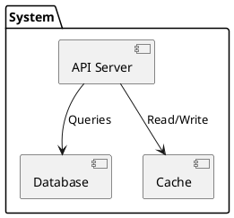
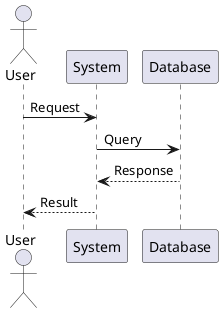
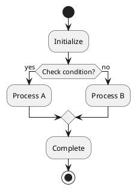
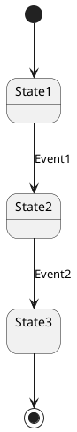

name: doc-plantuml-diagram-generator
description: Generate PlantUML diagrams for visualizing architecture, processes, sequences, and states in technical documentation and educational materials. Use when user needs visual representations, architecture diagrams, or process flows.
---

# PlantUML Diagram Generator

Create PlantUML diagrams to visualize complex architectures, processes, and system interactions in technical documentation and educational materials.

## Primary intent

Generate PlantUML source for visual diagrams that explain architecture, processes, or interactions.

## Use when

- User requests diagrams or visualizations
- Need to explain architecture or processes
- Documentation or educational materials need visual aids
- User mentions "diagram", "visualize", "architecture", "process flow", "flowchart"
- Explaining complex system interactions, hierarchical structures, or data flows
- Creating documentation for presentations or learning content

## Do NOT use when

- The task is purely textual formatting or readability rewrite
- The task is file structure reorganization
- The task is glossary/translation work
- The task is compatibility/version changelog authoring

## Use other skills instead when

- Use `doc-enhance-technical-markdown` for richer textual explanations
- Use `doc-reorganize-project-structure` for file moves and layout changes
- Use `doc-i18n-create-terminology-glossary` for terminology work
- Use `doc-documentation-versioning` for changelog/compatibility maintenance

## Instructions

### 1. Determine Diagram Type

Choose appropriate diagram type:
- **Component Diagram**: System components and relationships
- **Deployment Diagram**: Physical deployment architecture
- **Sequence Diagram**: Process interactions over time
- **Activity Diagram**: Workflow and processes
- **State Diagram**: State machines and transitions
- **Class Diagram**: Entity relationships (for OOP)
- **Architecture**: Component diagrams, deployment diagrams
- **Network**: Network diagrams, topology diagrams

### 2. Identify Components

For architecture diagrams:
- List all system components
- Identify relationships between components
- Determine grouping (packages, namespaces)
- Map data flows and interactions

### 3. Create PlantUML Code

Generate PlantUML syntax:
```plantuml
@startuml Diagram Name
!define RECTANGLE class
!define COMPONENT component

package "System Name" {
  COMPONENT "Component 1" as comp1
  COMPONENT "Component 2" as comp2
  RECTANGLE "Entity" as entity
}

comp1 --> comp2 : Interaction
comp2 --> entity : Data flow

note right of comp1 : "Important note"

@enduml
```

### 4. Add Annotations

Enhance diagrams with:
- **Labels**: Descriptive text on relationships
- **Notes**: Additional explanations
- **Colors**: Visual grouping
- **Stereotypes**: Component types

### 5. For Educational Materials (Optional)

When creating diagrams for learning content:
- **Number diagrams**: Diagram 1, Diagram 2, etc., for easy reference
- **Add text transitions**: Before each diagram, add a short paragraph (e.g. "**Diagram 1** below shows...") explaining what the diagram illustrates and its key elements
- **Register in index**: Maintain a diagram index with number, location, description, and key elements
- **Reference in text**: Use "Diagram X below shows..." before and "As shown in **Diagram X**, ..." after

Example transition:
```markdown
**Diagram 1** below illustrates the complete network architecture
of the Kubernetes cluster, showing how Flannel, MetalLB, and
external access interact.
```

### 6. Organize in Documentation

Structure diagrams in docs:
- Create `DIAGRAMS.md` file (or add to existing doc)
- Group by category (architecture, processes, states)
- Add descriptions for each diagram
- Include rendering instructions

### 7. Provide Rendering Instructions

Include how to generate images:
```bash
# Install PlantUML
sudo apt install plantuml

# Generate PNG
plantuml -tpng DIAGRAMS.md

# Generate SVG
plantuml -tsvg DIAGRAMS.md
```

### 8. Link from Main Documentation

Add references:
- Link to diagrams from relevant sections
- Include diagram thumbnails if possible
- Reference in table of contents

## Best Practices

- ✅ Use standard PlantUML syntax
- ✅ Keep diagrams simple and readable
- ✅ Use consistent styling across diagrams
- ✅ Add meaningful labels and annotations
- ✅ Group related components logically
- ✅ Include rendering instructions
- ✅ Document diagram purpose
- ✅ For educational content: number diagrams, add text transitions, maintain diagram index
- ✅ Keep diagrams focused (one concept per diagram)

## Diagram Type Guidelines

### Component Diagram


### Sequence Diagram


### Activity Diagram


### State Diagram


## Common Patterns

### Kubernetes Architecture
```plantuml
package "Kubernetes Cluster" {
  package "Control Plane" {
    component "API Server" as api
    component "etcd" as etcd
  }
  package "Data Plane" {
    component "kubelet" as kubelet
    component "kube-proxy" as proxy
  }
}
api --> etcd
kubelet --> api
```

### Process Flow
```plantuml
start
:User Request;
:Validate Input;
if (Valid?) then (yes)
  :Process Request;
  :Return Result;
else (no)
  :Return Error;
endif
stop
```

## What NOT to Do

- ❌ Don't create overly complex diagrams (split into multiple if needed)
- ❌ Don't mix diagram types inappropriately
- ❌ Don't forget to test PlantUML syntax
- ❌ Don't skip rendering instructions
- ❌ Don't create diagrams without context
- ❌ Don't use inconsistent styling
- ❌ For educational materials: don't skip numbering or diagram index

## Example Workflow

1. **Analyze**: Determine what needs visualization
2. **Choose**: Select appropriate diagram type
3. **Design**: Plan component layout and relationships
4. **Generate**: Create PlantUML code
5. **Test**: Verify syntax and rendering
6. **Document**: Add to documentation with context; for educational materials add numbering, transitions, and index
7. **Link**: Reference from relevant sections

## Validation Checklist

Before completing:
- [ ] Diagram syntax is valid PlantUML
- [ ] Diagram is focused on one concept
- [ ] Styling is consistent with other diagrams
- [ ] Rendering instructions included (or referenced)
- [ ] For educational materials: diagram numbered, text transition added, registered in index

## Related Skills

- `doc-technical-documentation-structure` - Organize diagram documentation
- `doc-reorganize-project-structure` - Keep diagram links valid when files move

