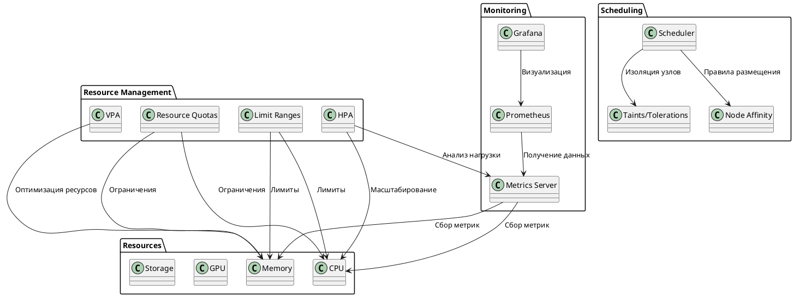
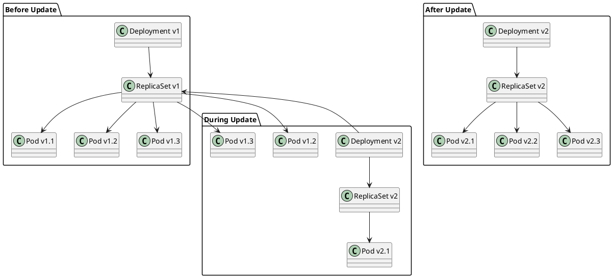
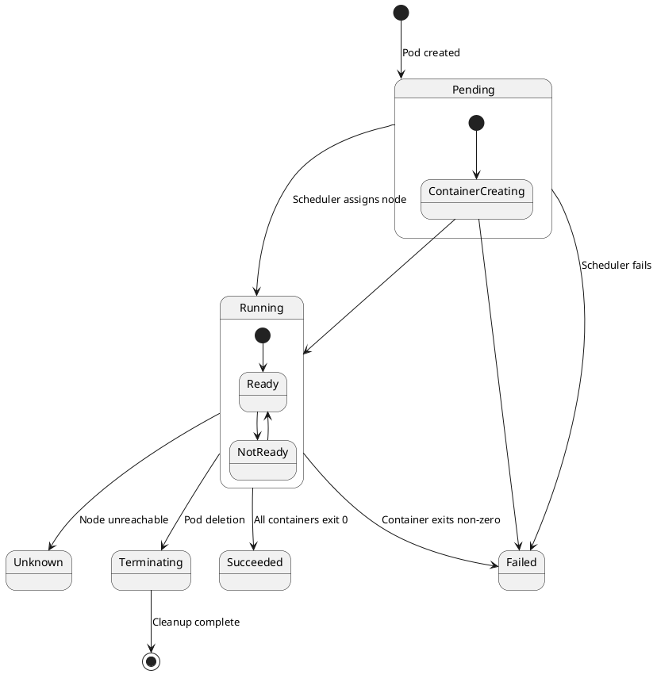
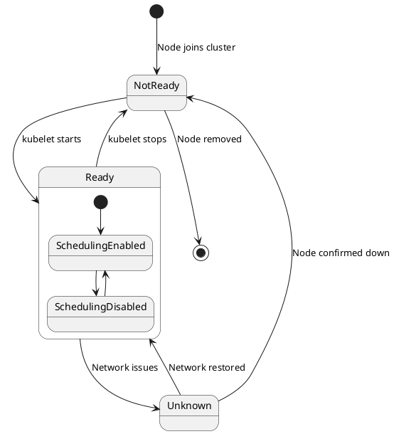
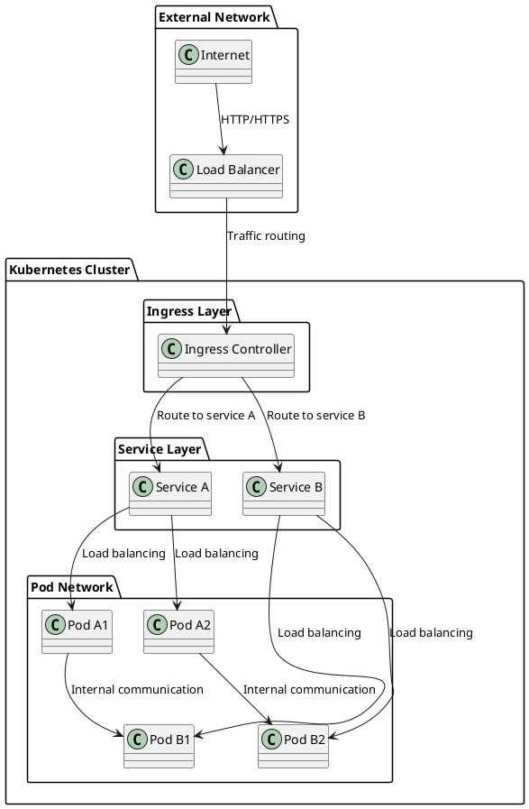
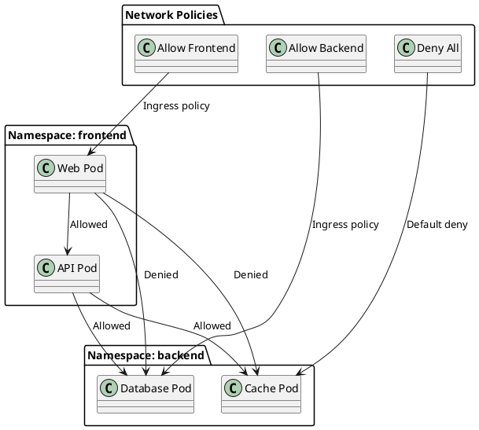
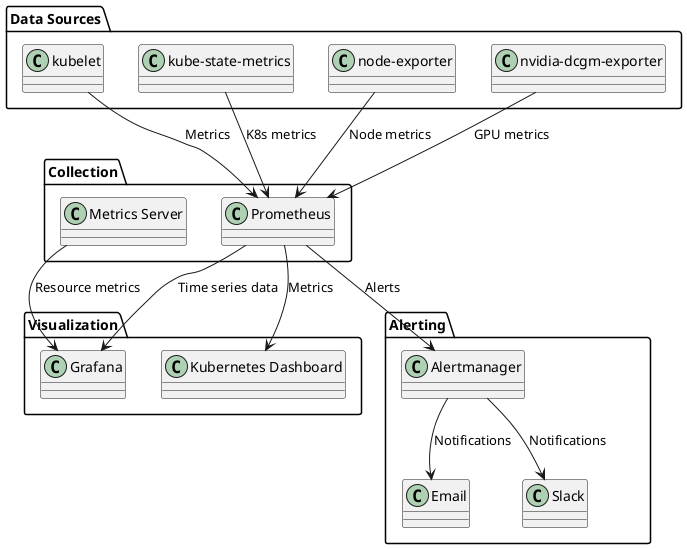
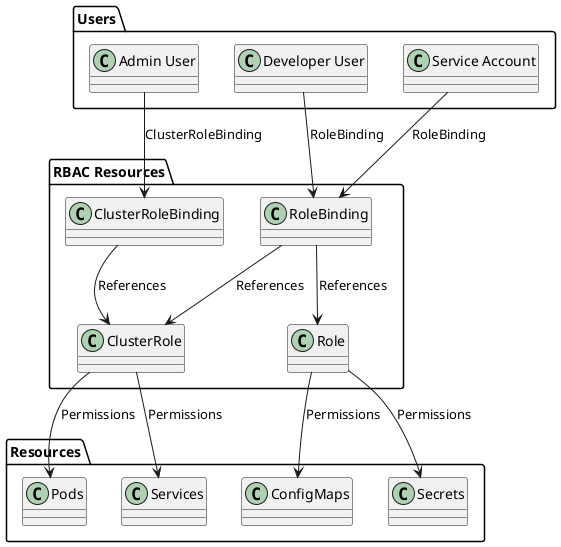
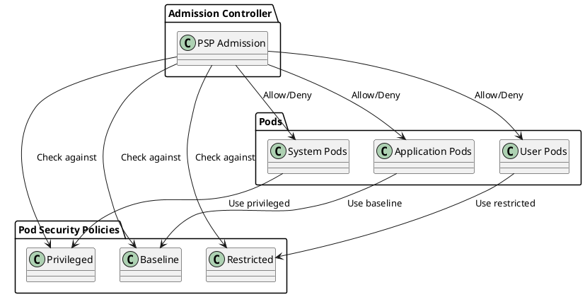

# Диаграммы и визуализация Kubernetes

## Контекст и обзор

Данный документ содержит PlantUML диаграммы для визуализации архитектуры Kubernetes, процессов оркестрации ресурсов и взаимодействия компонентов. Диаграммы помогают лучше понять сложные концепции и процессы.

**TL;DR:** Набор диаграмм для визуализации архитектуры и процессов Kubernetes с использованием PlantUML.

---

## Архитектура Kubernetes

### Общая архитектура кластера

```plantuml
@startuml Kubernetes Cluster Architecture
!define RECTANGLE class
!define COMPONENT component

package "Kubernetes Cluster" {
  package "Control Plane" {
    COMPONENT "API Server" as api
    COMPONENT "etcd" as etcd
    COMPONENT "Scheduler" as scheduler
    COMPONENT "Controller Manager" as cm
  }
  
  package "Data Plane" {
    package "Worker Node 1" {
      COMPONENT "kubelet" as kubelet1
      COMPONENT "kube-proxy" as proxy1
      COMPONENT "Container Runtime" as runtime1
      RECTANGLE "Pod 1" as pod1
      RECTANGLE "Pod 2" as pod2
    }
    
    package "Worker Node 2" {
      COMPONENT "kubelet" as kubelet2
      COMPONENT "kube-proxy" as proxy2
      COMPONENT "Container Runtime" as runtime2
      RECTANGLE "Pod 3" as pod3
      RECTANGLE "Pod 4" as pod4
    }
  }
}

' Связи Control Plane
api --> etcd : Хранение состояния
scheduler --> api : Получение данных
cm --> api : Управление ресурсами

' Связи Data Plane
kubelet1 --> api : Heartbeat, статус
kubelet2 --> api : Heartbeat, статус
proxy1 --> api : Сетевые правила
proxy2 --> api : Сетевые правила

' Связи внутри узлов
kubelet1 --> runtime1 : Управление контейнерами
kubelet2 --> runtime2 : Управление контейнерами
runtime1 --> pod1 : Запуск контейнеров
runtime1 --> pod2 : Запуск контейнеров
runtime2 --> pod3 : Запуск контейнеров
runtime2 --> pod4 : Запуск контейнеров

@enduml
```

### Процесс планирования подов

```plantuml
@startuml Pod Scheduling Process
!define RECTANGLE class

actor "User" as user
RECTANGLE "kubectl" as kubectl
RECTANGLE "API Server" as api
RECTANGLE "etcd" as etcd
RECTANGLE "Scheduler" as scheduler
RECTANGLE "kubelet" as kubelet
RECTANGLE "Container Runtime" as runtime
RECTANGLE "Pod" as pod

user -> kubectl : kubectl apply -f pod.yaml
kubectl -> api : POST /api/v1/pods
api -> etcd : Сохранение состояния
api -> scheduler : Уведомление о новом поде

scheduler -> api : GET /api/v1/pods?fieldSelector=spec.nodeName=
scheduler -> api : GET /api/v1/nodes
scheduler -> api : PATCH /api/v1/pods/{name}/binding

api -> kubelet : Уведомление о назначении пода
kubelet -> runtime : Создание контейнера
runtime -> pod : Запуск пода

kubelet -> api : Обновление статуса пода
api -> etcd : Сохранение статуса

@enduml
```

### Оркестрация ресурсов



---

## GPU и Multi-GPU архитектура

### Single Node Multi-GPU

```plantuml
@startuml Single Node Multi-GPU
!define RECTANGLE class
!define COMPONENT component

package "GPU Node" {
  COMPONENT "kubelet" as kubelet
  COMPONENT "NVIDIA Device Plugin" as ndp
  COMPONENT "Container Runtime" as runtime
  
  package "GPU Hardware" {
    RECTANGLE "GPU 0" as gpu0
    RECTANGLE "GPU 1" as gpu1
    RECTANGLE "GPU 2" as gpu2
    RECTANGLE "GPU 3" as gpu3
  }
  
  package "GPU Pods" {
    RECTANGLE "ML Pod 1" as mlpod1
    RECTANGLE "ML Pod 2" as mlpod2
    RECTANGLE "Render Pod" as renderpod
  }
}

' Связи GPU
gpu0 --> ndp : Обнаружение
gpu1 --> ndp : Обнаружение
gpu2 --> ndp : Обнаружение
gpu3 --> ndp : Обнаружение

ndp --> kubelet : Регистрация ресурсов
kubelet --> runtime : Управление контейнерами

runtime --> mlpod1 : GPU 0,1
runtime --> mlpod2 : GPU 2
runtime --> renderpod : GPU 3

' NVLink связи (если доступны)
gpu0 -[#blue]-> gpu1 : NVLink
gpu2 -[#blue]-> gpu3 : NVLink

@enduml
```

### Multi-Node GPU Cluster

```plantuml
@startuml Multi-Node GPU Cluster
!define RECTANGLE class
!define COMPONENT component

package "Kubernetes Cluster" {
  package "Control Plane" {
    COMPONENT "API Server" as api
    COMPONENT "Scheduler" as scheduler
  }
  
  package "GPU Node 1" {
    COMPONENT "kubelet" as kubelet1
    COMPONENT "NVIDIA Device Plugin" as ndp1
    RECTANGLE "GPU 0" as gpu0
    RECTANGLE "GPU 1" as gpu1
    RECTANGLE "ML Pod 1" as mlpod1
  }
  
  package "GPU Node 2" {
    COMPONENT "kubelet" as kubelet2
    COMPONENT "NVIDIA Device Plugin" as ndp2
    RECTANGLE "GPU 2" as gpu2
    RECTANGLE "GPU 3" as gpu3
    RECTANGLE "ML Pod 2" as mlpod2
  }
  
  package "GPU Node 3" {
    COMPONENT "kubelet" as kubelet3
    COMPONENT "NVIDIA Device Plugin" as ndp3
    RECTANGLE "GPU 4" as gpu4
    RECTANGLE "GPU 5" as gpu5
    RECTANGLE "Render Pod" as renderpod
  }
}

' Связи Control Plane
api --> scheduler : Управление планированием
scheduler --> kubelet1 : Назначение подов
scheduler --> kubelet2 : Назначение подов
scheduler --> kubelet3 : Назначение подов

' Связи GPU
gpu0 --> ndp1
gpu1 --> ndp1
gpu2 --> ndp2
gpu3 --> ndp2
gpu4 --> ndp3
gpu5 --> ndp3

ndp1 --> kubelet1
ndp2 --> kubelet2
ndp3 --> kubelet3

kubelet1 --> mlpod1
kubelet2 --> mlpod2
kubelet3 --> renderpod

' Сетевые связи между узлами
kubelet1 -[#green]-> kubelet2 : GPU Communication
kubelet2 -[#green]-> kubelet3 : GPU Communication

@enduml
```

---

## Процессы и последовательности

### Процесс развертывания приложения

```plantuml
@startuml Application Deployment Process
!define RECTANGLE class

actor "Developer" as dev
RECTANGLE "CI/CD Pipeline" as cicd
RECTANGLE "Container Registry" as registry
RECTANGLE "kubectl" as kubectl
RECTANGLE "API Server" as api
RECTANGLE "Scheduler" as scheduler
RECTANGLE "kubelet" as kubelet
RECTANGLE "Container Runtime" as runtime
RECTANGLE "Application Pod" as app

dev -> cicd : Push code
cicd -> registry : Build & push image
cicd -> kubectl : Deploy application
kubectl -> api : Apply deployment

api -> scheduler : New deployment
scheduler -> api : Schedule pods
api -> kubelet : Create pods
kubelet -> runtime : Pull image
runtime -> app : Start containers

kubelet -> api : Pod status
api -> dev : Deployment complete

@enduml
```

### Процесс автоскейлинга

```plantuml
@startuml Autoscaling Process
!define RECTANGLE class

RECTANGLE "HPA Controller" as hpa
RECTANGLE "Metrics Server" as metrics
RECTANGLE "API Server" as api
RECTANGLE "Deployment" as deployment
RECTANGLE "ReplicaSet" as rs
RECTANGLE "Pods" as pods

loop "Autoscaling Loop"
  hpa -> metrics : Get CPU/Memory metrics
  metrics -> hpa : Current utilization
  
  alt Utilization > Target
    hpa -> api : Scale up deployment
    api -> deployment : Update replicas
    deployment -> rs : Create new replicas
    rs -> pods : Create new pods
  else Utilization < Target
    hpa -> api : Scale down deployment
    api -> deployment : Update replicas
    deployment -> rs : Remove replicas
    rs -> pods : Terminate pods
  end
end

@enduml
```

### Процесс обновления приложения



---

## Состояния и жизненные циклы

### Жизненный цикл пода



### Состояния узла



---

## Сетевые диаграммы

### Сетевая архитектура



### Сетевые политики



---

## Мониторинг и алертинг

### Архитектура мониторинга



### Процесс алертинга

```plantuml
@startuml Alerting Process
!define RECTANGLE class

RECTANGLE "Prometheus" as prom
RECTANGLE "Alert Rules" as rules
RECTANGLE "Alertmanager" as am
RECTANGLE "Notification Channels" as nc
RECTANGLE "Users" as users

prom -> rules : Evaluate rules
rules -> prom : Trigger alerts
prom -> am : Send alerts
am -> am : Group & deduplicate
am -> nc : Route notifications
nc -> users : Deliver alerts

state prom {
  [*] --> Collecting
  Collecting --> Evaluating
  Evaluating --> Alerting
  Alerting --> Collecting
}

state am {
  [*] --> Receiving
  Receiving --> Grouping
  Grouping --> Routing
  Routing --> Sending
  Sending --> Receiving
}

@enduml
```

---

## Безопасность

### RBAC архитектура



### Политики безопасности подов



---

## Использование диаграмм

### Генерация изображений

Для генерации изображений из PlantUML диаграмм используйте:

```bash
# Установка PlantUML
sudo apt install plantuml

# Генерация PNG изображений
plantuml -tpng DIAGRAMS.md

# Генерация SVG изображений
plantuml -tsvg DIAGRAMS.md

# Генерация PDF
plantuml -tpdf DIAGRAMS.md
```

### Онлайн редактор

Можно использовать онлайн редактор PlantUML:
- [PlantUML Online Server](http://www.plantuml.com/plantuml/uml/)
- [PlantText](https://www.planttext.com/)

### Интеграция с документацией

Диаграммы можно интегрировать в документацию:

```markdown

```

### Лучшие практики

1. **Простота**: Избегайте перегруженных диаграмм
2. **Консистентность**: Используйте единый стиль
3. **Актуальность**: Регулярно обновляйте диаграммы
4. **Документирование**: Добавляйте пояснения к диаграммам

---

## Краткое резюме

Диаграммы PlantUML предоставляют мощный инструмент для визуализации сложных архитектур и процессов Kubernetes. Они помогают лучше понять взаимодействие компонентов и упрощают обучение и документирование.

## Рекомендации

- Используйте диаграммы для объяснения сложных концепций
- Регулярно обновляйте диаграммы при изменении архитектуры
- Интегрируйте диаграммы в документацию и презентации
- Используйте единый стиль для всех диаграмм

## Ссылки

- [PlantUML Documentation](https://plantuml.com/)
- [PlantUML Language Reference](https://plantuml.com/guide)
- [Kubernetes Architecture](https://kubernetes.io/docs/concepts/architecture/)
