# Учебное пособие: Kubernetes кластер с Ansible, MetalLB, Local Storage и Monitoring

## Введение и цели обучения
К концу этого пособия вы:
- Поймете базовые концепции Kubernetes: архитектуру, объекты, сетевую модель и хранилище.
- Освоите автоматизацию развертывания кластера с помощью Ansible ролей из этого репозитория.
- Настроите балансировку нагрузки в bare metal среде с MetalLB.
- Поднимете локальное хранилище с Local Storage Provisioner.
- Развернете мониторинг на Prometheus + Grafana и, при необходимости, мониторинг GPU.
- Научитесь диагностировать и устранять основные проблемы, а также применять лучшие практики.

Стартовые требования:
- Базовые навыки работы в Linux и SSH
- Представление о контейнерах (Docker/containerd)
- Доступ к машине управления (control node) и к узлам кластера (master/worker)

---

## Дорожная карта обучения
1) База: Что такое Kubernetes и Ansible (теория)
2) Подготовка окружения и сети (практика)
3) Развертывание кластера Kubernetes (практика)
4) Сети в кластере: Flannel и MetalLB (теория + практика)
5) Хранилище: Local Storage Provisioner (теория + практика)
6) Мониторинг: Prometheus + Grafana (+ GPU) (теория + практика)
7) Развертывание приложений и публикация сервисов (практика)
8) Эксплуатация: диагностика, безопасность, обновления (теория + практика)

### 📋 Отслеживание прогресса
Для эффективного изучения используйте [чек-листы самооценки](PROGRESS_CHECKLISTS.md), которые помогут:
- Отслеживать прогресс по каждому разделу
- Проводить регулярную самооценку знаний
- Определять области для дополнительного изучения
- Планировать дальнейшее развитие

---

## Теоретическая база
### Основы Kubernetes (обзор)
- Kubernetes — система оркестрации контейнеров для автоматизации развертывания, масштабирования и управления приложениями.
- Архитектура (подробно см. `k8s.md`):
  - Control Plane: `kube-apiserver`, `etcd`, `kube-scheduler`, `kube-controller-manager`.
  - Data Plane: узлы с `kubelet`, `kube-proxy`, контейнерным рантаймом (containerd).
- Ключевые объекты:
  - Pod, Deployment, Service (ClusterIP, NodePort, LoadBalancer), Ingress
  - ConfigMap, Secret
  - PersistentVolume (PV), PersistentVolumeClaim (PVC), StorageClass
- Принципы:
  - Декларативное описание желаемого состояния (YAML)
  - Контроллеры приводят текущее состояние к желаемому

**Диаграмма 1** ниже показывает архитектуру Kubernetes с разделением на Control Plane и Data Plane, а также взаимодействие между компонентами.

#### Архитектура Kubernetes
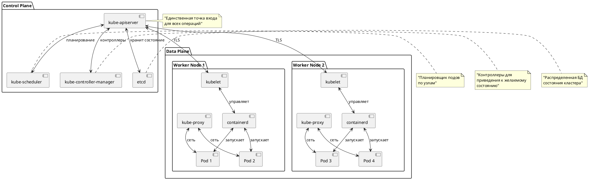

#### Иерархия объектов Kubernetes
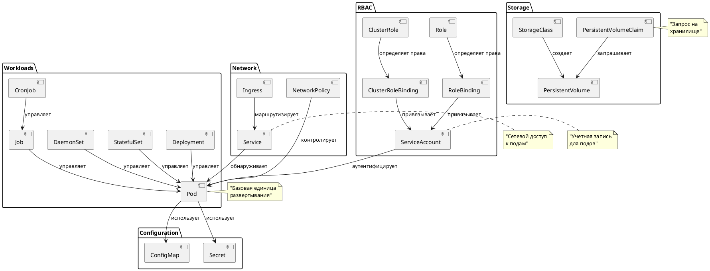

**Диаграмма 2** демонстрирует иерархию объектов Kubernetes и их взаимосвязи, показывая как различные ресурсы взаимодействуют друг с другом.

### Ansible и роли репозитория
- Ansible — средство автоматизации для идемпотентных изменений на удаленных хостах.
- Этот репозиторий структурирован по ролям:
  - `kubernetes_master`: containerd, kubeadm/kubelet/kubectl, инициализация control plane
  - `kubernetes_worker`: подготовка worker и присоединение к кластеру
  - `kubernetes_network`: установка CNI (Flannel)
  - `metallb`: установка и конфигурация MetalLB (IP pools, L2 advertisements)
  - `storage`: Local Storage Provisioner и StorageClass
  - `monitoring`: Prometheus, Grafana, Node Exporter (+ опционально NVIDIA)
  - `demo_app`: тестовое приложение nginx с сервисом типа LoadBalancer

**Диаграмма 3** иллюстрирует структуру Ansible ролей и их зависимости, показывая как роли связаны между собой и выполняются в определенном порядке.

#### Структура Ansible ролей
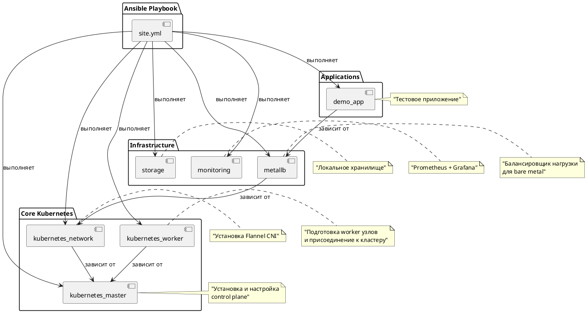

**Диаграмма 4** отображает пошаговый процесс развертывания кластера от подготовки окружения до запуска тестового приложения.

#### Процесс развертывания кластера
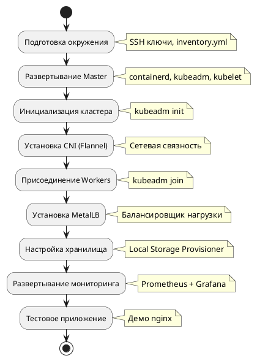

### Сети в Kubernetes, Flannel и MetalLB
- CNI-плагин Flannel создает pod-сеть и маршрутизацию между узлами.
- Сервис типа LoadBalancer в облаках получает внешний IP от облачного L4-балансировщика. На bare metal такую роль выполняет MetalLB, выдавая IP из заранее подготовленного пула.
- MetalLB режим Layer 2:
  - Объявляет внешний IP в вашей L2-сети (ARP/NDP), без внешних маршрутизаторов.
  - Требует единый L2-домен и пул IP-адресов вне DHCP.

**Диаграмма 5** показывает полную сетевую архитектуру кластера, включая взаимодействие между Flannel, MetalLB и внешними клиентами.

#### Сетевая архитектура
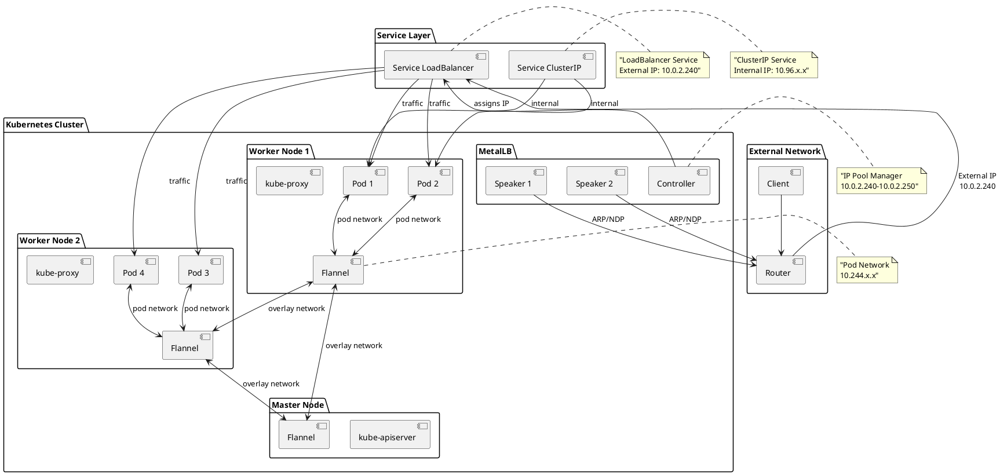

#### Типы сервисов Kubernetes
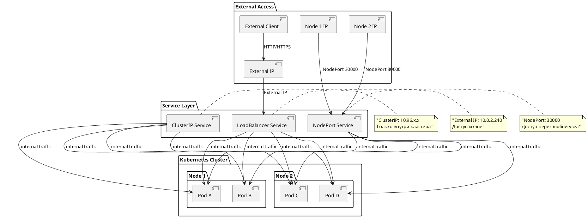

**Диаграмма 6** демонстрирует различные типы сервисов Kubernetes и способы доступа к приложениям из внешней сети.

### Хранилище: Local Storage Provisioner
- Минимальная по сложности модель хранения для лабораторий и небольших кластеров.
- Плюсы: простота, производительность. Минусы: привязка к узлу, нет репликации.

**Диаграмма 7** иллюстрирует архитектуру локального хранилища и взаимодействие между компонентами системы хранения.

#### Архитектура хранилища
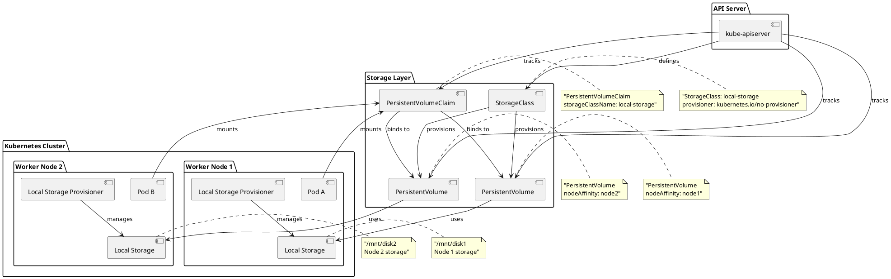

#### Жизненный цикл PersistentVolume
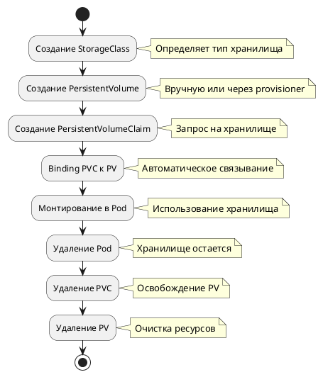

**Диаграмма 8** показывает жизненный цикл PersistentVolume от создания до удаления, включая все этапы управления хранилищем.

### Мониторинг: Prometheus + Grafana (+ GPU)
- Prometheus собирает метрики; Grafana визуализирует; Node Exporter — метрики узлов; возможен NVIDIA/DCGM Exporter для GPU.
- Для практики достаточно локального доступа через `kubectl port-forward`.

**Диаграмма 9** отображает архитектуру системы мониторинга с компонентами Prometheus, Grafana и различными экспортерами метрик.

#### Архитектура мониторинга
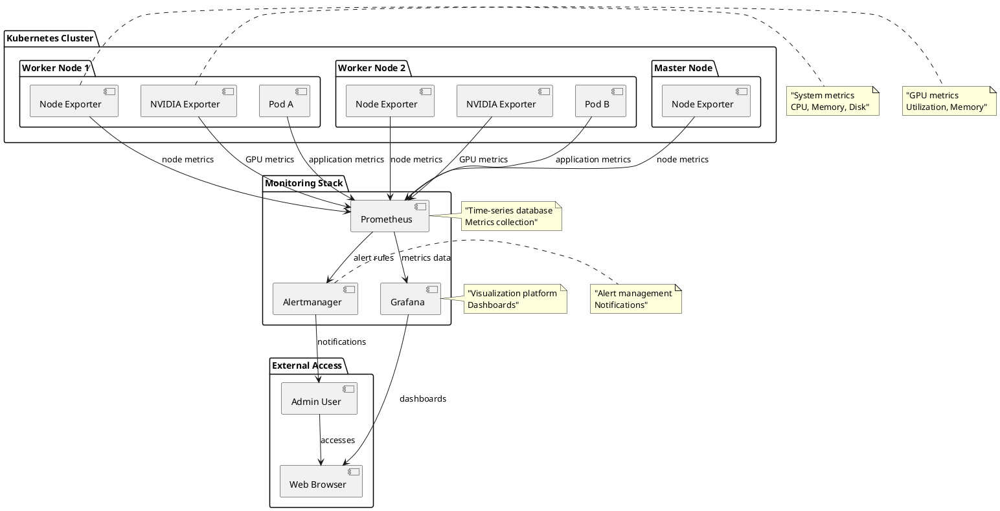

#### Поток данных мониторинга
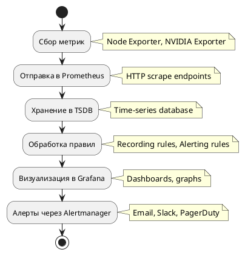

**Диаграмма 10** показывает поток данных в системе мониторинга от сбора метрик до генерации алертов.

**Диаграмма 11** детализирует компоненты мониторинга и их взаимосвязи, включая источники данных и каналы уведомлений.

#### Компоненты мониторинга
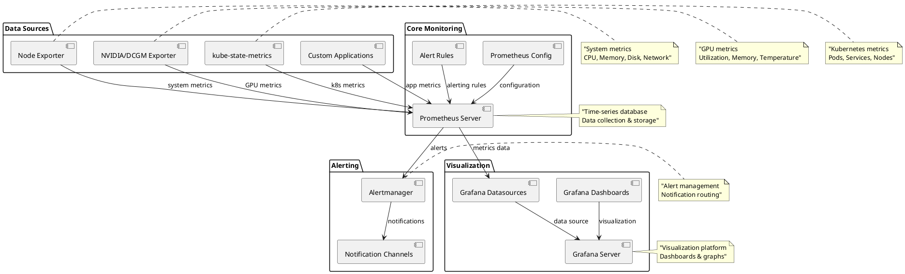

Теперь, когда мы изучили теоретические основы и архитектуру системы, переходим к практическим лабораторным работам. **Диаграмма 12** ниже показывает концептуальную схему всего кластера для общего понимания.

---

## Визуальная схема (концептуально)
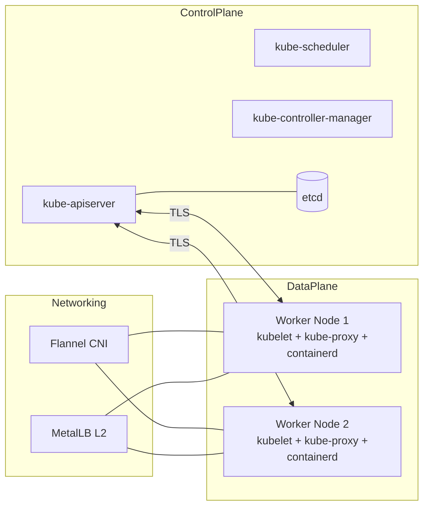

---

## Практические примеры и лабораторные работы
Ниже — связные лабораторные шаги. Большинство команд уже подготовлены в файлах репозитория.

### Лаборатория 0. Подготовка окружения
1) Настройте control node и SSH доступ:
```bash
sudo apt update && sudo apt install ansible -y
ssh-keygen -t rsa -b 4096 -C "ansible@control"
ssh-copy-id user@10.0.2.5  # master
ssh-copy-id user@10.0.2.6  # worker-01
ssh-copy-id user@10.0.2.7  # worker-02
```
2) Клонируйте репозиторий и перейдите в него:
```bash
git clone <repository-url>
cd kubernetes-with-ansible
```
3) Отредактируйте `inventory.yml` под вашу сеть и пользователей.

Ожидаемый результат: вы готовы запускать playbook'и.

### Лаборатория 1. Развертывание базового кластера
Полный вариант:
```bash
ansible-playbook -i inventory.yml site.yml
```
Пошаговый вариант:
```bash
# master
ansible-playbook -i inventory.yml site.yml --limit master_nodes
# сеть (Flannel)
ansible-playbook -i inventory.yml site.yml --tags kubernetes_network
# workers
ansible-playbook -i inventory.yml site.yml --limit worker_nodes
```
Проверка на master:
```bash
kubectl get nodes
kubectl get pods --all-namespaces
```
Ожидаемо все узлы в статусе Ready, системные поды Running.

### Лаборатория 2. MetalLB и публикация сервисов
1) Установка MetalLB:
```bash
ansible-playbook -i inventory.yml site.yml --tags metallb
```
2) Проверьте компоненты:
```bash
kubectl get namespace metallb-system
kubectl get pods -n metallb-system
kubectl get ipaddresspools -n metallb-system
kubectl get l2advertisements -n metallb-system
```
3) Демо-приложение nginx и внешний IP:
```bash
ansible-playbook -i inventory.yml site.yml --tags demo_app
kubectl get svc -n demo
curl http://10.0.2.240
```
4) Автотест:
```bash
./scripts/test-metallb.sh
```

Совет: Диапазон IP пулов задается в `metallb/defaults/main.yml`. Держите его вне DHCP.

### Лаборатория 3. Local Storage Provisioner
1) Установка:
```bash
ansible-playbook -i inventory.yml site.yml --tags storage
```
2) Проверка:
```bash
kubectl get storageclass
kubectl get pods -n local-storage-system
kubectl get pv
```
3) Демо-приложение:
```bash
kubectl apply -f examples/local-storage-example.yml
kubectl port-forward svc/storage-demo 8080:80
# откройте http://localhost:8080
```
4) Автотест:
```bash
./scripts/test-local-storage.sh
```

### Лаборатория 4. Мониторинг (Prometheus + Grafana)
1) Установка:
```bash
ansible-playbook -i inventory.yml site.yml --tags monitoring
```
2) Доступ:
```bash
# Prometheus
kubectl port-forward -n monitoring svc/prometheus 9090:9090
# http://localhost:9090
# Grafana
kubectl port-forward -n monitoring svc/grafana 3000:3000
# http://localhost:3000  (admin / admin123)
```
3) Импортируйте дашборды в Grafana (ID: 315, 1860, 3662).
4) Автотест:
```bash
./scripts/test-monitoring.sh
```

### Лаборатория 5 (опционально). Мониторинг GPU (NVIDIA)
1) Включите экспортёр:
```bash
# в monitoring/defaults/main.yml
nvidia_exporter_enabled: true
```
2) Примените роль повторно:
```bash
ansible-playbook -i inventory.yml site.yml --tags monitoring
```
3) Проверка и метрики:
```bash
kubectl get pods -n monitoring -l app=nvidia-exporter
kubectl port-forward -n monitoring svc/nvidia-exporter 9400:9400
curl http://localhost:9400/metrics | head -20
```

### Лаборатория 6. Свое приложение и LoadBalancer
```bash
kubectl create deployment my-app --image=nginx
kubectl expose deployment my-app --port=80 --type=LoadBalancer
kubectl get svc my-app
```
Если MetalLB работает — сервис получит внешний IP из пула, и вы сможете открыть его извне.

---

## Проверка знаний и упражнения
### Вопросы для самопроверки
- Что такое Control Plane и Data Plane? Какие компоненты в каждом?
- Чем Service типов ClusterIP, NodePort и LoadBalancer отличаются?
- Зачем нужен MetalLB на bare metal? Какие требования к сети для L2?
- В чем плюсы/минусы Local Storage Provisioner? Для каких сценариев он подходит?
- Что собирает Prometheus, а что отображает Grafana? Какие метрики критичны?

### Практические задания
1) Измените пул IP для MetalLB (например, на вашу подсеть) и проверьте выдачу IP.
2) Добавьте новый worker-узел в `inventory.yml` и включите его в кластер.
3) Задайте `requests`/`limits` для собственного Deployment и проверьте планирование.
4) Настройте HPA для веб-приложения при порогe CPU 50%.
5) Создайте PVC на 1Gi с `storageClassName: local-storage` и примонтируйте его в под.
6) Импортируйте рекомендованные дашборды в Grafana и добавьте один свой график.
7) Примените пример алертов из `examples/monitoring-alerts.yml` и сымитируйте срабатывание.

Критерии успешности: задания выполнены, сервисы доступны, дашборды отображают метрики, алерты срабатывают корректно.

---

## Устранение неполадок (cheatsheet)

При возникновении проблем в кластере важно следовать систематическому подходу к диагностике. **Диаграмма 13** ниже показывает пошаговый алгоритм устранения неполадок.

#### Процесс диагностики проблем
```plantuml
@startuml Troubleshooting Process
!define RECTANGLE class

start

:Обнаружение проблемы;
note right: Симптомы, ошибки

:Проверка состояния кластера;
note right: kubectl get nodes
kubectl get pods --all-namespaces

if (Узлы не Ready?) then (да)
  :Диагностика узлов;
  note right: journalctl -u kubelet
  kubeadm token create
else (нет)
  :Проверка приложений;
  note right: kubectl get events
  kubectl describe pod
endif

if (Сеть не работает?) then (да)
  :Диагностика сети;
  note right: kubectl get pods -n kube-flannel
  ping между узлами
else (нет)
  :Проверка сервисов;
  note right: kubectl get svc
  kubectl describe svc
endif

if (MetalLB не работает?) then (да)
  :Диагностика MetalLB;
  note right: kubectl logs -n metallb-system
  kubectl get ipaddresspools
else (нет)
  :Проверка мониторинга;
  note right: kubectl logs -n monitoring
  kubectl port-forward
endif

:Применение решения;
note right: Исправление конфигурации
Перезапуск сервисов

:Проверка результата;
note right: Повторная проверка
Валидация функциональности

stop
@enduml
```

#### Команды для диагностики
- Узлы не присоединяются:
```bash
kubeadm token create --print-join-command
sudo journalctl -u kubelet -f
```
- MetalLB не назначает IP:
```bash
kubectl get pods -n metallb-system
kubectl logs -n metallb-system -l app=metallb -c controller
kubectl logs -n metallb-system -l app=metallb -c speaker
kubectl get ipaddresspools -n metallb-system -o yaml
kubectl get l2advertisements -n metallb-system -o yaml
```
- Сеть/Flannel:
```bash
kubectl get pods -n kube-flannel
ping <master-ip>  # с worker и наоборот
```
- Проверка событий и описаний:
```bash
kubectl get events --sort-by='.lastTimestamp'
kubectl describe node <node>
kubectl describe pod <pod> -n <ns>
kubectl describe service <svc> -n <ns>
```
- Grafana/Prometheus:
```bash
kubectl logs -n monitoring deployment/prometheus
kubectl logs -n monitoring deployment/grafana
kubectl get svc -n monitoring
```

---

## Лучшие практики

Для успешной эксплуатации кластера важно следовать установленным принципам и практикам. **Диаграмма 14** ниже иллюстрирует взаимосвязи между различными аспектами безопасности, производительности и операционных практик.

#### Принципы безопасности и производительности
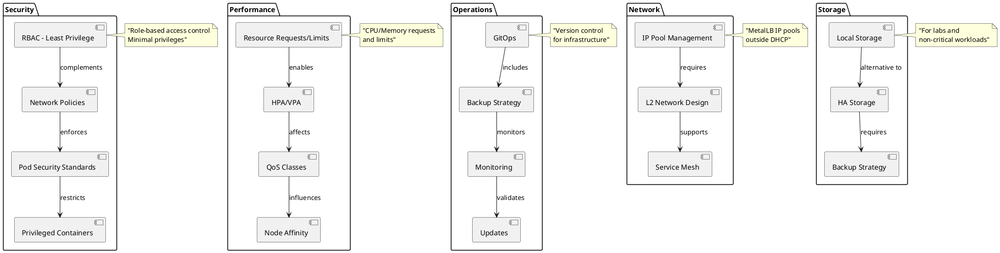

#### Чек-лист лучших практик
- **Сеть и IP:**
  - Держите IP пул MetalLB вне DHCP и вне используемых адресов.
  - Все узлы в одной L2-сети для режима L2.
- **Ресурсы:**
  - Всегда задавайте `requests` и `limits` для подов. Используйте HPA/VPA.
  - Следите за QoS классами (Guaranteed/Burstable/BestEffort).
- **Хранилище:**
  - Local Storage — для лабораторий и non-critical нагрузок. Для HA рассмотрите Longhorn/rook-ceph.
- **Безопасность:**
  - RBAC по принципу наименьших привилегий. Ограничивайте привилегированные контейнеры.
  - Сетевые политики для изоляции трафика между пространствами имен/приложениями.
- **Мониторинг и алерты:**
  - Настройте базовые алерты (CPU/RAM/Disk/Pod CrashLoop/Nodes NotReady).
  - Задайте разумный retention в Prometheus; мониторьте свободное место.
- **Операционные практики:**
  - Версионируйте манифесты, используйте GitOps.
  - Периодически обновляйте компоненты, перед обновлением делайте бэкапы.

---

## Глоссарий
- Control Plane: плоскость управления кластером (API, планирование, контроллеры).
- Data Plane: плоскость выполнения рабочих нагрузок на worker-узлах.
- CNI: интерфейс плагинов сети для pod-сети.
- Flannel: простой CNI-плагин для overlay-сети.
- Service (ClusterIP/NodePort/LoadBalancer): объекты для сетевого доступа к Pod'ам.
- MetalLB: реализация балансировщика (L2/BGP) для bare metal кластеров.
- StorageClass: класс хранилища, описывает как создавать PV.
- PV/PVC: объекты постоянного хранилища и запрос на него.
- Prometheus/Grafana: сбор и визуализация метрик.
- kubeadm/kubelet/kubectl: инструменты развертывания, агент узла и клиент CLI.

---

## Часто задаваемые вопросы (FAQ)
- Почему сервис LoadBalancer остается в Pending?
  - Нет доступных IP в пуле MetalLB; MetalLB не запущен; IP пул вне подсети; проблемы L2.
- Нужен ли MetalLB в облаке?
  - Нет, облачные провайдеры выдают внешние IP сами.
- Почему Local Storage может потерять данные?
  - Привязка к конкретному узлу; при его отказе данные недоступны.
- Как дать доступ `kubectl` с control node?
  - Скопируйте `admin.conf` с master в `~/.kube/config` и задайте права `chmod 600`.
- Flannel vs Calico?
  - Flannel проще и достаточно для старта; Calico дает NetworkPolicy без доп. компонентов и расширенные функции.

---

## Дополнительные ресурсы
- Kubernetes: [Документация](https://kubernetes.io/docs/) | [Компоненты кластера](https://kubernetes.io/ru/docs/concepts/overview/components/)
- kubeadm: [Инсталляция](https://kubernetes.io/docs/setup/production-environment/tools/kubeadm/install-kubeadm/)
- Ansible: [Документация](https://docs.ansible.com/)
- MetalLB: [Сайт](https://metallb.universe.tf/) | [Установка](https://metallb.universe.tf/installation/) | [Конфигурация](https://metallb.universe.tf/configuration/)
- Prometheus: [Docs](https://prometheus.io/docs/)
- Grafana: [Docs](https://grafana.com/docs/)
- Network Policies: [K8s Docs](https://kubernetes.io/docs/concepts/services-networking/network-policies/)

### 📋 Материалы для самооценки
- **[PROGRESS_CHECKLISTS.md](PROGRESS_CHECKLISTS.md)** - Чек-листы прогресса для самооценки знаний и навыков
- **[EXERCISES.md](EXERCISES.md)** - Практические упражнения по всем темам
- **[EXERCISES_6.1.md](EXERCISES_6.1.md)** - Расширенные упражнения по RBAC
- **[EXERCISES_6.2.md](EXERCISES_6.2.md)** - Расширенные упражнения по операторам
- **[EXERCISES_6.3.md](EXERCISES_6.3.md)** - Расширенные упражнения по GitOps

### 📚 Материалы из репозитория
- `DEPLOYMENT_GUIDE.md`, `QUICK_START.md`
- `METALLB_SETUP.md`, `metal-lb.md`
- `LOCAL_STORAGE_SUMMARY.md`, `QUICK_START_LOCAL_STORAGE.md`
- `MONITORING_SUMMARY.md`, `QUICK_START_MONITORING.md`, `NVIDIA_MONITORING_SUMMARY.md`, `QUICK_START_NVIDIA_MONITORING.md`
- Примеры: `examples/` и тесты: `scripts/test-*.sh`

---

## Приложение: контрольные листы
- Развертывание кластера:
  - [ ] SSH-ключи настроены, `inventory.yml` заполнен
  - [ ] Master и Workers в статусе Ready
  - [ ] Flannel поды Running
- MetalLB:
  - [ ] Namespace `metallb-system`
  - [ ] Pods controller/speaker Running
  - [ ] IPAddressPool и L2Advertisement присутствуют
- Local Storage:
  - [ ] StorageClass доступен
  - [ ] PV/PVC создаются
- Мониторинг:
  - [ ] Prometheus и Grafana Running
  - [ ] Дашборды импортированы
  - [ ] Алерты применены

---

## Расширенные темы для углубленного изучения

После освоения базовых концепций Kubernetes вы можете углубиться в более продвинутые темы. **Диаграмма 15** ниже представляет карту расширенных технологий и их взаимосвязей для дальнейшего изучения.

#### Карта расширенных технологий
```plantuml
@startuml Advanced Topics Map
!define RECTANGLE class

package "Security & Access Control" {
  [RBAC] as RBAC
  [Pod Security Standards] as PSS
  [Network Policies] as NP
  [Admission Controllers] as AC
}

package "Scaling & Performance" {
  [Horizontal Pod Autoscaler] as HPA
  [Vertical Pod Autoscaler] as VPA
  [Cluster Autoscaler] as CA
  [Resource Quotas] as RQ
}

package "Configuration Management" {
  [Helm Charts] as HELM
  [Kustomize] as KUST
  [GitOps - ArgoCD] as ARGOCD
  [GitOps - Flux] as FLUX
}

package "Alternative Solutions" {
  [Calico CNI] as CALICO
  [Cilium CNI] as CILIUM
  [Longhorn Storage] as LONGHORN
  [Rook-Ceph Storage] as ROOK
  [Thanos Monitoring] as THANOS
}

package "Advanced Networking" {
  [Service Mesh - Istio] as ISTIO
  [Service Mesh - Linkerd] as LINKERD
  [Ingress Controllers] as INGRESS
  [Load Balancing] as LB
}

package "Operators & Automation" {
  [Custom Operators] as OPERATORS
  [Operator SDK] as SDK
  [Kubebuilder] as KB
  [Custom Resources] as CR
}

' Security connections
RBAC --> PSS : "enables"
PSS --> NP : "complements"
NP --> AC : "enforced by"

' Scaling connections
HPA --> VPA : "complements"
VPA --> CA : "triggers"
CA --> RQ : "respects"

' Configuration connections
HELM --> KUST : "alternative to"
KUST --> ARGOCD : "used by"
ARGOCD --> FLUX : "alternative to"

' Alternative connections
CALICO --> CILIUM : "alternative to"
LONGHORN --> ROOK : "alternative to"
ROOK --> THANOS : "storage for"

' Networking connections
ISTIO --> LINKERD : "alternative to"
INGRESS --> LB : "provides"

' Operators connections
OPERATORS --> SDK : "built with"
SDK --> KB : "based on"
KB --> CR : "creates"

note right of RBAC : "Role-based access control\nService accounts & roles"
note right of HPA : "Automatic scaling\nbased on metrics"
note right of HELM : "Package manager\nfor Kubernetes"
note right of CALICO : "Advanced networking\nwith policy support"
note right of OPERATORS : "Custom controllers\nfor applications"
@enduml
```

### Безопасность и RBAC
После освоения базовых концепций изучите:
- Создание ServiceAccount и Role/ClusterRole
- Привязка ролей через RoleBinding/ClusterRoleBinding
- Политики безопасности подов (Pod Security Standards)
- Сетевые политики (Network Policies) для изоляции трафика

### Автоматическое масштабирование
- Horizontal Pod Autoscaler (HPA) на основе CPU/памяти
- Vertical Pod Autoscaler (VPA) для оптимизации ресурсов
- Cluster Autoscaler для автоматического добавления узлов

### Управление конфигурациями
- Helm charts для развертывания сложных приложений
- Kustomize для управления вариантами конфигураций
- GitOps с ArgoCD или Flux для автоматизации развертываний

### Альтернативные решения
- Сети: Calico, Cilium (с поддержкой eBPF)
- Хранилище: Longhorn, Rook-Ceph, OpenEBS
- Мониторинг: Thanos для долгосрочного хранения метрик

---

## Дополнительные практические задания

### Задание 8: Настройка RBAC
Создайте пользователя с ограниченными правами:
```bash
# Создайте namespace и ServiceAccount
kubectl create namespace restricted
kubectl create serviceaccount restricted-user -n restricted

# Создайте Role и RoleBinding
kubectl create role pod-reader --verb=get,list,watch --resource=pods -n restricted
kubectl create rolebinding restricted-user-binding --role=pod-reader --serviceaccount=restricted:restricted-user -n restricted
```

### Задание 9: Сетевая политика
Примените NetworkPolicy для изоляции трафика:
```yaml
apiVersion: networking.k8s.io/v1
kind: NetworkPolicy
metadata:
  name: deny-all
  namespace: restricted
spec:
  podSelector: {}
  policyTypes:
  - Ingress
  - Egress
```

### Задание 10: Мониторинг с кастомными метриками
Создайте собственный экспортер метрик и добавьте его в Prometheus:
```bash
# Пример простого экспортера
kubectl run custom-exporter --image=busybox --command -- sh -c "while true; do echo 'custom_metric 42'; sleep 30; done"
```

---

## Подготовка к сертификации

Для тех, кто планирует получить официальные сертификации Kubernetes, важно понимать структуру экзаменов и темы, которые они покрывают. **Диаграмма 16** ниже показывает карту сертификаций и их тематическое покрытие.

#### Карта сертификаций Kubernetes
```plantuml
@startuml Kubernetes Certifications
!define RECTANGLE class

package "Kubernetes Certifications" {
  [CKA] as CKA
  [CKAD] as CKAD
  [CKS] as CKS
}

package "CKA - Administrator" {
  [Cluster Architecture] as CA
  [Installation & Configuration] as IC
  [Workloads & Scheduling] as WS
  [Services & Networking] as SN
  [Storage] as ST
  [Troubleshooting] as TR
}

package "CKAD - Application Developer" {
  [Core Concepts] as CC
  [Configuration] as CF
  [Multi-Container Pods] as MCP
  [Observability] as OB
  [Services & Networking] as SN2
  [State Persistence] as SP
}

package "CKS - Security Specialist" {
  [Cluster Setup] as CS
  [Cluster Hardening] as CH
  [System Hardening] as SH
  [Minimize Microservice Vulnerabilities] as MMV
  [Supply Chain Security] as SCS
  [Monitoring, Logging & Runtime Security] as MLR
}

' CKA connections
CKA --> CA : "covers"
CKA --> IC : "covers"
CKA --> WS : "covers"
CKA --> SN : "covers"
CKA --> ST : "covers"
CKA --> TR : "covers"

' CKAD connections
CKAD --> CC : "covers"
CKAD --> CF : "covers"
CKAD --> MCP : "covers"
CKAD --> OB : "covers"
CKAD --> SN2 : "covers"
CKAD --> SP : "covers"

' CKS connections
CKS --> CS : "covers"
CKS --> CH : "covers"
CKS --> SH : "covers"
CKS --> MMV : "covers"
CKS --> SCS : "covers"
CKS --> MLR : "covers"

note right of CKA : "Certified Kubernetes\nAdministrator"
note right of CKAD : "Certified Kubernetes\nApplication Developer"
note right of CKS : "Certified Kubernetes\nSecurity Specialist"
note right of CA : "Control plane\nData plane\nETCD"
note right of IC : "kubeadm\nkubelet\nkubectl"
note right of TR : "Troubleshooting\nLogs\nEvents"
@enduml
```

#### Тематическое покрытие сертификаций
Этот материал покрывает многие темы для:
- **CKA (Certified Kubernetes Administrator)**: архитектура, развертывание, устранение неполадок
- **CKAD (Certified Kubernetes Application Developer)**: объекты, сервисы, конфигурации
- **CKS (Certified Kubernetes Security Specialist)**: безопасность, RBAC, сетевые политики

#### Рекомендуемые дополнительные ресурсы:
- [Kubernetes The Hard Way](https://github.com/kelseyhightower/kubernetes-the-hard-way)
- [Killer.sh](https://killer.sh/) - практические экзамены
- [Kubernetes.io Tasks](https://kubernetes.io/docs/tasks/) - практические задания

---

## Заключение

Поздравляем! Вы успешно прошли полный курс по развертыванию и управлению Kubernetes кластером. В ходе обучения мы изучили теоретические основы, рассмотрели архитектуру системы с помощью 16 диаграмм, выполнили практические лабораторные работы и освоили лучшие практики.

Вы создали полнофункциональный Kubernetes кластер с:
- ✅ Автоматизацией через Ansible
- ✅ Сетевым взаимодействием через Flannel
- ✅ Балансировкой нагрузки через MetalLB
- ✅ Локальным хранилищем
- ✅ Системой мониторинга
- ✅ Демо-приложениями

Теперь вы готовы:
1. **Экспериментировать** с различными конфигурациями
2. **Изучать** новые компоненты и плагины
3. **Применять** полученные знания в реальных проектах
4. **Готовиться** к сертификации Kubernetes
5. **Вносить вклад** в развитие инфраструктуры

Удачи в изучении Kubernetes и DevOps!

Готово к практике и экспериментам!

---

## 📋 Индекс диаграмм и примеров кода

### 🎨 Диаграммы PlantUML

| № | Название | Расположение | Описание | Ключевые элементы |
|---|----------|--------------|----------|-------------------|
| 1 | Архитектура Kubernetes | Теоретическая база → Основы Kubernetes | Архитектура с Control Plane и Data Plane | kube-apiserver, etcd, kubelet, kube-proxy |
| 2 | Иерархия объектов Kubernetes | Теоретическая база → Основы Kubernetes | Иерархия объектов и их взаимосвязи | Pod, Deployment, Service, ConfigMap, Secret |
| 3 | Структура Ansible ролей | Теоретическая база → Ansible и роли | Структура ролей и зависимости | kubernetes_master, kubernetes_worker, metallb |
| 4 | Процесс развертывания кластера | Теоретическая база → Ansible и роли | Пошаговый процесс развертывания | Подготовка, установка, настройка сети |
| 5 | Сетевая архитектура | Теоретическая база → Сети | Полная сетевая архитектура кластера | Flannel, MetalLB, внешний доступ |
| 6 | Типы сервисов Kubernetes | Теоретическая база → Сети | Различные типы сервисов | ClusterIP, NodePort, LoadBalancer |
| 7 | Архитектура хранилища | Теоретическая база → Хранилище | Архитектура локального хранилища | Local Storage Provisioner, PV/PVC |
| 8 | Жизненный цикл PersistentVolume | Теоретическая база → Хранилище | Жизненный цикл PV | Создание, binding, использование, очистка |
| 9 | Архитектура мониторинга | Теоретическая база → Мониторинг | Архитектура системы мониторинга | Prometheus, Grafana, Node Exporter |
| 10 | Поток данных мониторинга | Теоретическая база → Мониторинг | Поток данных в системе мониторинга | Сбор, хранение, визуализация, алерты |
| 11 | Компоненты мониторинга | Теоретическая база → Мониторинг | Компоненты и их взаимосвязи | Data Sources, Core Monitoring, Alerting |
| 12 | Концептуальная схема кластера | Визуальная схема | Концептуальная схема всего кластера | Control Plane, Data Plane, Networking |
| 13 | Процесс диагностики проблем | Устранение неполадок | Алгоритм устранения неполадок | Диагностика узлов, сети, сервисов |
| 14 | Принципы безопасности | Лучшие практики | Взаимосвязи безопасности и производительности | Security, Performance, Operations |
| 15 | Карта расширенных технологий | Расширенные темы | Карта технологий и взаимосвязей | Security, Scaling, Configuration Management |
| 16 | Карта сертификаций | Подготовка к сертификации | Карта сертификаций и тематическое покрытие | CKA, CKAD, CKS |

### 💻 Примеры кода

| Категория | Команда/Пример | Описание |
|-----------|----------------|----------|
| **Ansible Playbooks** | `ansible-playbook -i inventory.yml site.yml` | Полное развертывание кластера |
| | `ansible-playbook -i inventory.yml site.yml --tags metallb` | Установка MetalLB |
| | `ansible-playbook -i inventory.yml site.yml --tags storage` | Установка хранилища |
| | `ansible-playbook -i inventory.yml site.yml --tags monitoring` | Установка мониторинга |
| **Kubernetes команды** | `kubectl get nodes` | Проверка состояния узлов |
| | `kubectl get pods -n metallb-system` | Проверка MetalLB |
| | `kubectl get storageclass` | Проверка классов хранилища |
| | `kubectl port-forward svc/grafana 3000:3000` | Доступ к Grafana |
| **YAML манифесты** | Service LoadBalancer | Создание сервисов типа LoadBalancer |
| | PersistentVolumeClaim | Запросы на хранилище |
| | NetworkPolicy | Сетевые политики |
| | RBAC | Роли и привязки |
| **Bash скрипты** | `./scripts/test-metallb.sh` | Тест MetalLB |
| | `./scripts/test-local-storage.sh` | Тест хранилища |
| | `./scripts/test-monitoring.sh` | Тест мониторинга |

### 🔍 Быстрый поиск по темам

| Тема | Диаграммы | Примеры кода |
|------|-----------|--------------|
| **Архитектура и основы** | 1, 2, 12 | Ansible playbooks, kubectl команды |
| **Сети и балансировка нагрузки** | 5, 6 | MetalLB конфигурация, Service типы |
| **Хранилище** | 7, 8 | PV/PVC, StorageClass, Local Storage |
| **Мониторинг** | 9, 10, 11 | Prometheus, Grafana, экспортеры |
| **Безопасность и лучшие практики** | 13, 14 | RBAC, NetworkPolicy, диагностика |
| **Расширенные темы** | 15, 16 | Операторы, GitOps, сертификации |

### 📚 Полезные ссылки

| Категория | Ресурс | Описание |
|-----------|--------|----------|
| **Официальная документация** | [Kubernetes Docs](https://kubernetes.io/docs/) | Основная документация Kubernetes |
| | [Ansible Docs](https://docs.ansible.com/) | Документация Ansible |
| | [MetalLB Docs](https://metallb.universe.tf/) | Документация MetalLB |
| | [Prometheus Docs](https://prometheus.io/docs/) | Документация Prometheus |
| **Практические ресурсы** | [Kubernetes The Hard Way](https://github.com/kelseyhightower/kubernetes-the-hard-way) | Практический курс |
| | [Killer.sh](https://killer.sh/) | Практические экзамены |
| | [Kubernetes.io Tasks](https://kubernetes.io/docs/tasks/) | Практические задания |
| **Файлы репозитория** | `DEPLOYMENT_GUIDE.md` | Подробное руководство по развертыванию |
| | `QUICK_START.md` | Быстрый старт |
| | `METALLB_SETUP.md` | Настройка MetalLB |
| | `examples/` | Примеры конфигураций |
| | `scripts/` | Тестовые скрипты |

---

## Расширенные темы для углубленного изучения

### Безопасность и RBAC
После освоения базовых концепций изучите:
- Создание ServiceAccount и Role/ClusterRole
- Привязка ролей через RoleBinding/ClusterRoleBinding
- Политики безопасности подов (Pod Security Standards)
- Сетевые политики (Network Policies) для изоляции трафика

### Автоматическое масштабирование
- Horizontal Pod Autoscaler (HPA) на основе CPU/памяти
- Vertical Pod Autoscaler (VPA) для оптимизации ресурсов
- Cluster Autoscaler для автоматического добавления узлов

### Управление конфигурациями
- Helm charts для развертывания сложных приложений
- Kustomize для управления вариантами конфигураций
- GitOps с ArgoCD или Flux для автоматизации развертываний

### Альтернативные решения
- Сети: Calico, Cilium (с поддержкой eBPF)
- Хранилище: Longhorn, Rook-Ceph, OpenEBS
- Мониторинг: Thanos для долгосрочного хранения метрик

---

## Дополнительные практические задания

### Задание 8: Настройка RBAC
Создайте пользователя с ограниченными правами:
```bash
# Создайте namespace и ServiceAccount
kubectl create namespace restricted
kubectl create serviceaccount restricted-user -n restricted

# Создайте Role и RoleBinding
kubectl create role pod-reader --verb=get,list,watch --resource=pods -n restricted
kubectl create rolebinding restricted-user-binding --role=pod-reader --serviceaccount=restricted:restricted-user -n restricted
```

### Задание 9: Сетевая политика
Примените NetworkPolicy для изоляции трафика:
```yaml
apiVersion: networking.k8s.io/v1
kind: NetworkPolicy
metadata:
  name: deny-all
  namespace: restricted
spec:
  podSelector: {}
  policyTypes:
  - Ingress
  - Egress
```

### Задание 10: Мониторинг с кастомными метриками
Создайте собственный экспортер метрик и добавьте его в Prometheus:
```bash
# Пример простого экспортера
kubectl run custom-exporter --image=busybox --command -- sh -c "while true; do echo 'custom_metric 42'; sleep 30; done"
```

---

## Подготовка к сертификации
Этот материал покрывает многие темы для:
- **CKA (Certified Kubernetes Administrator)**: архитектура, развертывание, устранение неполадок
- **CKAD (Certified Kubernetes Application Developer)**: объекты, сервисы, конфигурации
- **CKS (Certified Kubernetes Security Specialist)**: безопасность, RBAC, сетевые политики

Рекомендуемые дополнительные ресурсы:
- [Kubernetes The Hard Way](https://github.com/kelseyhightower/kubernetes-the-hard-way)
- [Killer.sh](https://killer.sh/) - практические экзамены
- [Kubernetes.io Tasks](https://kubernetes.io/docs/tasks/) - практические задания

---

## Заключение
Вы создали полнофункциональный Kubernetes кластер с:
- ✅ Автоматизацией через Ansible
- ✅ Сетевым взаимодействием через Flannel
- ✅ Балансировкой нагрузки через MetalLB
- ✅ Локальным хранилищем
- ✅ Системой мониторинга
- ✅ Демо-приложениями

Теперь вы готовы:
1. **Экспериментировать** с различными конфигурациями
2. **Изучать** новые компоненты и плагины
3. **Применять** полученные знания в реальных проектах
4. **Готовиться** к сертификации Kubernetes
5. **Вносить вклад** в развитие инфраструктуры

Удачи в изучении Kubernetes и DevOps!