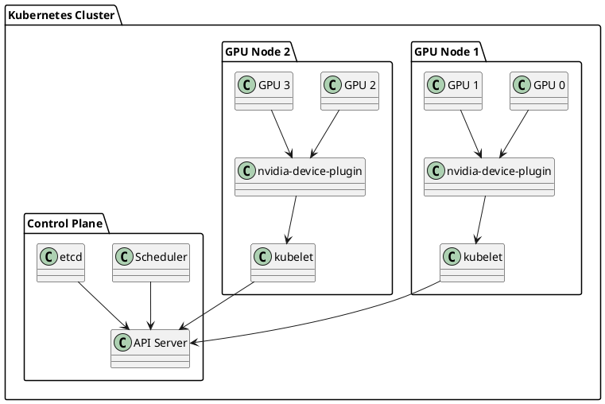

# Multi-GPU поддержка в Kubernetes

## Контекст и обзор

Multi-GPU конфигурации в Kubernetes позволяют эффективно использовать несколько графических процессоров на одном узле или распределить GPU ресурсы между несколькими узлами. Это критически важно для задач машинного обучения, научных вычислений и рендеринга, требующих значительных вычислительных ресурсов.

**TL;DR:** Руководство по настройке и управлению несколькими GPU в Kubernetes кластере для высокопроизводительных вычислений.

---

## Архитектура Multi-GPU систем

### Типы Multi-GPU конфигураций

#### 1. Single Node Multi-GPU
**Описание**: Несколько GPU на одном физическом узле.

**Преимущества**:
- Низкая задержка меж-GPU коммуникации
- Простота управления
- Высокая пропускная способность через NVLink/PCIe

**Ограничения**:
- Ограниченное количество GPU на узел
- Единая точка отказа
- Ограничения по питанию и охлаждению

#### 2. Multi-Node GPU Cluster
**Описание**: GPU распределены по нескольким узлам кластера.

**Преимущества**:
- Масштабируемость до сотен GPU
- Отказоустойчивость
- Гибкость в распределении ресурсов

**Ограничения**:
- Сетевая задержка между узлами
- Сложность синхронизации
- Требования к сетевой инфраструктуре

### Диаграмма архитектуры



---

## Настройка Multi-GPU узлов

### 1. Подготовка узла

#### Проверка оборудования
```bash
#!/bin/bash
# check-gpu-hardware.sh

echo "=== Проверка GPU оборудования ==="

# Проверка количества GPU
echo "Количество GPU:"
nvidia-smi --list-gpus | wc -l

# Информация о каждом GPU
echo -e "\nДетальная информация о GPU:"
nvidia-smi --query-gpu=index,name,memory.total,memory.free,utilization.gpu --format=csv

# Проверка NVLink (если доступен)
echo -e "\nПроверка NVLink:"
nvidia-smi nvlink --status

# Проверка топологии GPU
echo -e "\nТопология GPU:"
nvidia-smi topo -m

# Проверка драйверов
echo -e "\nВерсия драйвера:"
nvidia-smi --query-gpu=driver_version --format=csv,noheader,nounits | head -1
```

#### Установка драйверов и CUDA
```bash
#!/bin/bash
# install-gpu-drivers.sh

echo "=== Установка GPU драйверов и CUDA ==="

# Обновление системы
sudo apt update && sudo apt upgrade -y

# Установка NVIDIA драйверов
sudo apt install -y nvidia-driver-535

# Установка CUDA toolkit
wget https://developer.download.nvidia.com/compute/cuda/repos/ubuntu2204/x86_64/cuda-keyring_1.1-1_all.deb
sudo dpkg -i cuda-keyring_1.1-1_all.deb
sudo apt update
sudo apt install -y cuda-toolkit-12-3

# Установка cuDNN (требует регистрации на NVIDIA)
# sudo apt install -y libcudnn8

# Проверка установки
echo "Проверка CUDA:"
nvcc --version

echo "Проверка GPU:"
nvidia-smi
```

### 2. Настройка NVIDIA Device Plugin

#### Установка Device Plugin
```bash
#!/bin/bash
# install-nvidia-device-plugin.sh

echo "=== Установка NVIDIA Device Plugin ==="

# Создание namespace для GPU компонентов
kubectl create namespace gpu-resources

# Установка NVIDIA Device Plugin
kubectl apply -f https://raw.githubusercontent.com/NVIDIA/k8s-device-plugin/v0.14.1/nvidia-device-plugin.yml

# Проверка установки
echo "Проверка Device Plugin:"
kubectl get pods -n kube-system | grep nvidia-device-plugin

# Проверка доступности GPU
echo "Доступные GPU ресурсы:"
kubectl get nodes -o json | jq '.items[].status.allocatable | select(.nvidia.com/gpu != null)'
```

#### Конфигурация Device Plugin
```yaml
# nvidia-device-plugin-config.yaml
apiVersion: v1
kind: ConfigMap
metadata:
  name: nvidia-device-plugin-config
  namespace: kube-system
data:
  config.yaml: |
    version: v1
    sharing:
      mps:
        resources:
        - name: nvidia.com/gpu
          replicas: 4
    flags:
      migStrategy: single
      failOnInitError: true
      deviceListStrategy: envvar
      deviceIDStrategy: uuid
---
apiVersion: apps/v1
kind: DaemonSet
metadata:
  name: nvidia-device-plugin-daemonset
  namespace: kube-system
spec:
  selector:
    matchLabels:
      name: nvidia-device-plugin-ds
  template:
    metadata:
      labels:
        name: nvidia-device-plugin-ds
    spec:
      tolerations:
      - key: nvidia.com/gpu
        operator: Exists
        effect: NoSchedule
      containers:
      - image: nvcr.io/nvidia/k8s-device-plugin:v0.14.1
        name: nvidia-device-plugin-ctr
        args: ["--fail-on-init-error=false"]
        securityContext:
          allowPrivilegeEscalation: false
          capabilities:
            drop: ["ALL"]
        volumeMounts:
          - name: device-plugin
            mountPath: /var/lib/kubelet/device-plugins
      volumes:
        - name: device-plugin
          hostPath:
            path: /var/lib/kubelet/device-plugins
```

### 3. Настройка узлов

#### Маркировка GPU узлов
```bash
#!/bin/bash
# label-gpu-nodes.sh

echo "=== Маркировка GPU узлов ==="

# Получение списка узлов с GPU
GPU_NODES=$(kubectl get nodes -o json | jq -r '.items[] | select(.status.allocatable["nvidia.com/gpu"] != null) | .metadata.name')

for node in $GPU_NODES; do
    echo "Маркировка узла: $node"
    
    # Основные метки GPU
    kubectl label node $node nvidia.com/gpu=true --overwrite
    kubectl label node $node accelerator=nvidia --overwrite
    
    # Метки для типов GPU (если известны)
    kubectl label node $node gpu-type=rtx4090 --overwrite
    
    # Метки для топологии
    kubectl label node $node topology.kubernetes.io/zone=gpu-zone --overwrite
    
    echo "Узел $node успешно промаркирован"
done

echo "Проверка маркировки:"
kubectl get nodes --show-labels | grep nvidia.com/gpu
```

---

## Управление Multi-GPU ресурсами

### 1. Запрос GPU ресурсов

#### Базовый запрос GPU
```yaml
# single-gpu-pod.yaml
apiVersion: v1
kind: Pod
metadata:
  name: single-gpu-pod
spec:
  containers:
  - name: gpu-container
    image: nvidia/cuda:12.0-base-ubuntu20.04
    command: ["nvidia-smi"]
    resources:
      limits:
        nvidia.com/gpu: 1
      requests:
        nvidia.com/gpu: 1
```

#### Запрос нескольких GPU
```yaml
# multi-gpu-pod.yaml
apiVersion: v1
kind: Pod
metadata:
  name: multi-gpu-pod
spec:
  containers:
  - name: gpu-container
    image: nvidia/cuda:12.0-base-ubuntu20.04
    command: ["nvidia-smi"]
    resources:
      limits:
        nvidia.com/gpu: 4
      requests:
        nvidia.com/gpu: 4
    env:
    - name: NVIDIA_VISIBLE_DEVICES
      value: "all"
    - name: NVIDIA_DRIVER_CAPABILITIES
      value: "compute,utility"
```

### 2. Планирование на GPU узлах

#### Node Affinity для GPU
```yaml
# gpu-affinity-pod.yaml
apiVersion: v1
kind: Pod
metadata:
  name: gpu-affinity-pod
spec:
  affinity:
    nodeAffinity:
      requiredDuringSchedulingIgnoredDuringExecution:
        nodeSelectorTerms:
        - matchExpressions:
          - key: nvidia.com/gpu
            operator: Exists
      preferredDuringSchedulingIgnoredDuringExecution:
      - weight: 100
        preference:
          matchExpressions:
          - key: gpu-type
            operator: In
            values:
            - rtx4090
  containers:
  - name: gpu-container
    image: nvidia/cuda:12.0-base-ubuntu20.04
    command: ["nvidia-smi"]
    resources:
      limits:
        nvidia.com/gpu: 2
      requests:
        nvidia.com/gpu: 2
```

#### Taints и Tolerations
```bash
#!/bin/bash
# setup-gpu-taints.sh

echo "=== Настройка taints для GPU узлов ==="

# Получение списка GPU узлов
GPU_NODES=$(kubectl get nodes -o json | jq -r '.items[] | select(.status.allocatable["nvidia.com/gpu"] != null) | .metadata.name')

for node in $GPU_NODES; do
    echo "Настройка taint для узла: $node"
    
    # Добавление taint для GPU узлов
    kubectl taint nodes $node nvidia.com/gpu=true:NoSchedule --overwrite
    
    echo "Taint добавлен для узла $node"
done

echo "Проверка taints:"
kubectl get nodes -o custom-columns=NAME:.metadata.name,TAINTS:.spec.taints
```

### 3. GPU Sharing и MPS

#### Настройка GPU Sharing
```yaml
# gpu-sharing-config.yaml
apiVersion: v1
kind: ConfigMap
metadata:
  name: nvidia-device-plugin-config
  namespace: kube-system
data:
  config.yaml: |
    version: v1
    sharing:
      mps:
        resources:
        - name: nvidia.com/gpu
          replicas: 4
        - name: nvidia.com/mig-1g.5gb
          replicas: 7
    flags:
      migStrategy: single
      failOnInitError: true
      deviceListStrategy: envvar
      deviceIDStrategy: uuid
```

#### Использование разделенных GPU
```yaml
# shared-gpu-pod.yaml
apiVersion: v1
kind: Pod
metadata:
  name: shared-gpu-pod
spec:
  containers:
  - name: gpu-container
    image: nvidia/cuda:12.0-base-ubuntu20.04
    command: ["nvidia-smi"]
    resources:
      limits:
        nvidia.com/gpu: 0.25  # 1/4 GPU
      requests:
        nvidia.com/gpu: 0.25
    env:
    - name: NVIDIA_MPS_PIPE_DIRECTORY
      value: "/tmp/nvidia-mps"
    - name: NVIDIA_MPS_LOG_DIRECTORY
      value: "/tmp/nvidia-log"
```

---

## Мониторинг Multi-GPU систем

### 1. Настройка мониторинга

#### Prometheus экспортер для GPU
```yaml
# gpu-monitoring.yaml
apiVersion: v1
kind: ConfigMap
metadata:
  name: gpu-monitoring-config
  namespace: monitoring
data:
  nvidia-dcgm-exporter.yaml: |
    apiVersion: v1
    kind: Service
    metadata:
      name: nvidia-dcgm-exporter
      namespace: monitoring
    spec:
      ports:
      - port: 9400
        targetPort: 9400
      selector:
        app: nvidia-dcgm-exporter
---
apiVersion: apps/v1
kind: DaemonSet
metadata:
  name: nvidia-dcgm-exporter
  namespace: monitoring
spec:
  selector:
    matchLabels:
      app: nvidia-dcgm-exporter
  template:
    metadata:
      labels:
        app: nvidia-dcgm-exporter
    spec:
      tolerations:
      - key: nvidia.com/gpu
        operator: Exists
        effect: NoSchedule
      containers:
      - name: nvidia-dcgm-exporter
        image: nvcr.io/nvidia/k8s/dcgm-exporter:3.1.8-3.1.5-ubuntu20.04
        args:
        - "-f"
        - "/etc/dcgm-exporter/dcp-metrics-included.csv"
        ports:
        - containerPort: 9400
        volumeMounts:
        - name: config
          mountPath: /etc/dcgm-exporter
      volumes:
      - name: config
        configMap:
          name: gpu-monitoring-config
```

#### Grafana дашборд для GPU
```json
{
  "dashboard": {
    "title": "GPU Monitoring Dashboard",
    "panels": [
      {
        "title": "GPU Utilization",
        "type": "graph",
        "targets": [
          {
            "expr": "DCGM_FI_DEV_GPU_UTIL",
            "legendFormat": "GPU {{gpu}}"
          }
        ]
      },
      {
        "title": "GPU Memory Usage",
        "type": "graph",
        "targets": [
          {
            "expr": "DCGM_FI_DEV_MEM_COPY_UTIL",
            "legendFormat": "GPU {{gpu}}"
          }
        ]
      },
      {
        "title": "GPU Temperature",
        "type": "graph",
        "targets": [
          {
            "expr": "DCGM_FI_DEV_GPU_TEMP",
            "legendFormat": "GPU {{gpu}}"
          }
        ]
      }
    ]
  }
}
```

### 2. Скрипты мониторинга

#### Мониторинг GPU состояния
```bash
#!/bin/bash
# monitor-gpu.sh

echo "=== Мониторинг GPU состояния ==="

# Проверка GPU в кластере
echo "GPU в кластере:"
kubectl get nodes -o json | jq '.items[] | {name: .metadata.name, gpu: .status.allocatable["nvidia.com/gpu"]} | select(.gpu != null)'

# Проверка использования GPU
echo -e "\nИспользование GPU:"
kubectl get pods --all-namespaces -o json | jq '.items[] | select(.spec.containers[].resources.limits["nvidia.com/gpu"] != null) | {namespace: .metadata.namespace, pod: .metadata.name, gpu: .spec.containers[].resources.limits["nvidia.com/gpu"]}'

# Проверка GPU на узлах
echo -e "\nДетальная информация о GPU на узлах:"
for node in $(kubectl get nodes -o json | jq -r '.items[] | select(.status.allocatable["nvidia.com/gpu"] != null) | .metadata.name'); do
    echo "Узел: $node"
    kubectl debug node/$node -it --image=ubuntu -- chroot /host nvidia-smi
done
```

#### Алерты для GPU
```yaml
# gpu-alerts.yaml
apiVersion: monitoring.coreos.com/v1
kind: PrometheusRule
metadata:
  name: gpu-alerts
  namespace: monitoring
spec:
  groups:
  - name: gpu.rules
    rules:
    - alert: GPUHighUtilization
      expr: DCGM_FI_DEV_GPU_UTIL > 90
      for: 5m
      labels:
        severity: warning
      annotations:
        summary: "GPU utilization is high"
        description: "GPU {{ $labels.gpu }} utilization is {{ $value }}%"
    
    - alert: GPUHighTemperature
      expr: DCGM_FI_DEV_GPU_TEMP > 80
      for: 2m
      labels:
        severity: critical
      annotations:
        summary: "GPU temperature is critical"
        description: "GPU {{ $labels.gpu }} temperature is {{ $value }}°C"
    
    - alert: GPUOutOfMemory
      expr: DCGM_FI_DEV_MEM_COPY_UTIL > 95
      for: 3m
      labels:
        severity: warning
      annotations:
        summary: "GPU memory usage is high"
        description: "GPU {{ $labels.gpu }} memory usage is {{ $value }}%"
```

---

## Оптимизация производительности

### 1. Настройка GPU планирования

#### GPU Topology Awareness
```yaml
# gpu-topology-pod.yaml
apiVersion: v1
kind: Pod
metadata:
  name: gpu-topology-pod
spec:
  affinity:
    nodeAffinity:
      requiredDuringSchedulingIgnoredDuringExecution:
        nodeSelectorTerms:
        - matchExpressions:
          - key: nvidia.com/gpu
            operator: Exists
    podAffinity:
      requiredDuringSchedulingIgnoredDuringExecution:
      - labelSelector:
          matchExpressions:
          - key: app
            operator: In
            values:
            - gpu-workload
        topologyKey: kubernetes.io/hostname
  containers:
  - name: gpu-container
    image: nvidia/cuda:12.0-base-ubuntu20.04
    command: ["nvidia-smi"]
    resources:
      limits:
        nvidia.com/gpu: 2
      requests:
        nvidia.com/gpu: 2
    env:
    - name: CUDA_VISIBLE_DEVICES
      value: "0,1"  # Использование соседних GPU
```

### 2. Оптимизация памяти

#### GPU Memory Management
```yaml
# gpu-memory-pod.yaml
apiVersion: v1
kind: Pod
metadata:
  name: gpu-memory-pod
spec:
  containers:
  - name: gpu-container
    image: nvidia/cuda:12.0-base-ubuntu20.04
    command: ["python3", "-c", "import torch; print(torch.cuda.get_device_properties(0))"]
    resources:
      limits:
        nvidia.com/gpu: 1
        memory: "8Gi"
      requests:
        nvidia.com/gpu: 1
        memory: "4Gi"
    env:
    - name: PYTORCH_CUDA_ALLOC_CONF
      value: "max_split_size_mb:128"
    - name: CUDA_MEMORY_FRACTION
      value: "0.8"
```

### 3. Масштабирование GPU приложений

#### Horizontal Pod Autoscaler для GPU
```yaml
# gpu-hpa.yaml
apiVersion: autoscaling/v2
kind: HorizontalPodAutoscaler
metadata:
  name: gpu-hpa
spec:
  scaleTargetRef:
    apiVersion: apps/v1
    kind: Deployment
    name: gpu-deployment
  minReplicas: 1
  maxReplicas: 10
  metrics:
  - type: Resource
    resource:
      name: nvidia.com/gpu
      target:
        type: Utilization
        averageUtilization: 70
  - type: Resource
    resource:
      name: cpu
      target:
        type: Utilization
        averageUtilization: 80
```

---

## Troubleshooting Multi-GPU

### 1. Диагностические скрипты

#### Проверка GPU состояния
```bash
#!/bin/bash
# diagnose-gpu.sh

echo "=== Диагностика GPU ==="

# Проверка драйверов
echo "1. Проверка драйверов NVIDIA:"
if command -v nvidia-smi &> /dev/null; then
    nvidia-smi
else
    echo "ERROR: nvidia-smi не найден"
    exit 1
fi

# Проверка Device Plugin
echo -e "\n2. Проверка NVIDIA Device Plugin:"
kubectl get pods -n kube-system | grep nvidia-device-plugin
kubectl logs -n kube-system -l name=nvidia-device-plugin-ds

# Проверка доступности GPU
echo -e "\n3. Проверка доступности GPU в кластере:"
kubectl get nodes -o json | jq '.items[] | {name: .metadata.name, gpu: .status.allocatable["nvidia.com/gpu"]} | select(.gpu != null)'

# Проверка GPU на узлах
echo -e "\n4. Проверка GPU на узлах:"
for node in $(kubectl get nodes -o json | jq -r '.items[] | select(.status.allocatable["nvidia.com/gpu"] != null) | .metadata.name'); do
    echo "Узел: $node"
    kubectl debug node/$node -it --image=ubuntu -- chroot /host nvidia-smi --list-gpus
done

# Проверка использования GPU
echo -e "\n5. Проверка использования GPU:"
kubectl get pods --all-namespaces -o json | jq '.items[] | select(.spec.containers[].resources.limits["nvidia.com/gpu"] != null) | {namespace: .metadata.namespace, pod: .metadata.name, gpu: .spec.containers[].resources.limits["nvidia.com/gpu"]}'
```

#### Проверка сетевого взаимодействия GPU
```bash
#!/bin/bash
# check-gpu-network.sh

echo "=== Проверка сетевого взаимодействия GPU ==="

# Проверка NVLink
echo "1. Проверка NVLink:"
nvidia-smi nvlink --status

# Проверка топологии
echo -e "\n2. Проверка топологии GPU:"
nvidia-smi topo -m

# Проверка пропускной способности
echo -e "\n3. Тест пропускной способности между GPU:"
if command -v bandwidthTest &> /dev/null; then
    bandwidthTest --memory=pinned --mode=quick
else
    echo "bandwidthTest не найден. Установите CUDA samples."
fi

# Проверка сетевого взаимодействия между узлами
echo -e "\n4. Проверка сетевого взаимодействия между узлами:"
kubectl get nodes -o json | jq '.items[] | select(.status.allocatable["nvidia.com/gpu"] != null) | .metadata.name' | while read node; do
    echo "Тестирование узла: $node"
    kubectl debug node/$node -it --image=ubuntu -- chroot /host ping -c 3 8.8.8.8
done
```

### 2. Частые проблемы и решения

#### Проблема: GPU не обнаружены
**Симптомы**: Device Plugin не видит GPU, ошибки в логах.

**Решение**:
```bash
# Проверка драйверов
sudo nvidia-smi

# Перезапуск Device Plugin
kubectl delete pod -n kube-system -l name=nvidia-device-plugin-ds

# Проверка прав доступа
sudo chmod 666 /dev/nvidia*
```

#### Проблема: Неравномерное распределение нагрузки
**Симптомы**: Некоторые GPU перегружены, другие простаивают.

**Решение**:
```yaml
# gpu-load-balancing.yaml
apiVersion: v1
kind: Pod
metadata:
  name: balanced-gpu-pod
spec:
  affinity:
    podAntiAffinity:
      preferredDuringSchedulingIgnoredDuringExecution:
      - weight: 100
        podAffinityTerm:
          labelSelector:
            matchExpressions:
            - key: app
              operator: In
              values:
              - gpu-workload
          topologyKey: kubernetes.io/hostname
  containers:
  - name: gpu-container
    image: nvidia/cuda:12.0-base-ubuntu20.04
    resources:
      limits:
        nvidia.com/gpu: 1
      requests:
        nvidia.com/gpu: 1
```

#### Проблема: Высокая температура GPU
**Симптомы**: GPU перегреваются, снижается производительность.

**Решение**:
```bash
# Настройка управления питанием
sudo nvidia-smi -pm 1
sudo nvidia-smi -ac 1215,1410  # Установка лимитов мощности

# Мониторинг температуры
watch -n 1 'nvidia-smi --query-gpu=temperature.gpu --format=csv,noheader,nounits'
```

---

## Лучшие практики

### 1. Планирование ресурсов

#### Рекомендации по планированию
- **Мониторинг**: Регулярно отслеживайте использование GPU
- **Балансировка**: Равномерно распределяйте нагрузку между GPU
- **Резервирование**: Оставляйте 10-20% GPU ресурсов для непредвиденных задач
- **Документирование**: Ведите документацию по конфигурации GPU

#### Чек-лист настройки
- [ ] Установлены актуальные драйверы NVIDIA
- [ ] Настроен NVIDIA Device Plugin
- [ ] Узлы промаркированы метками GPU
- [ ] Настроен мониторинг GPU
- [ ] Настроены алерты для критических состояний
- [ ] Протестирована отказоустойчивость
- [ ] Документированы процедуры восстановления

### 2. Безопасность

#### Рекомендации по безопасности
- **Изоляция**: Используйте Network Policies для изоляции GPU трафика
- **Доступ**: Ограничивайте доступ к GPU узлам
- **Мониторинг**: Отслеживайте подозрительную активность
- **Обновления**: Регулярно обновляйте драйверы и компоненты

### 3. Производительность

#### Оптимизация производительности
- **Топология**: Учитывайте топологию GPU при планировании
- **Память**: Оптимизируйте использование GPU памяти
- **Сеть**: Используйте высокоскоростные сети для межузлового взаимодействия
- **Мониторинг**: Постоянно отслеживайте метрики производительности

---

## Краткое резюме

Multi-GPU поддержка в Kubernetes обеспечивает эффективное использование нескольких графических процессоров для высокопроизводительных вычислений. Правильная настройка включает установку драйверов, настройку Device Plugin, мониторинг и оптимизацию производительности.

## Рекомендации

- Начинайте с простых конфигураций и постепенно усложняйте
- Регулярно мониторьте состояние GPU
- Документируйте все изменения конфигурации
- Тестируйте отказоустойчивость системы

## Ссылки

- [NVIDIA Device Plugin Documentation](https://github.com/NVIDIA/k8s-device-plugin)
- [Kubernetes GPU Support](https://kubernetes.io/docs/tasks/manage-gpus/scheduling-gpus/)
- [NVIDIA CUDA Documentation](https://docs.nvidia.com/cuda/)
- [DCGM Documentation](https://docs.nvidia.com/datacenter/dcgm/)
