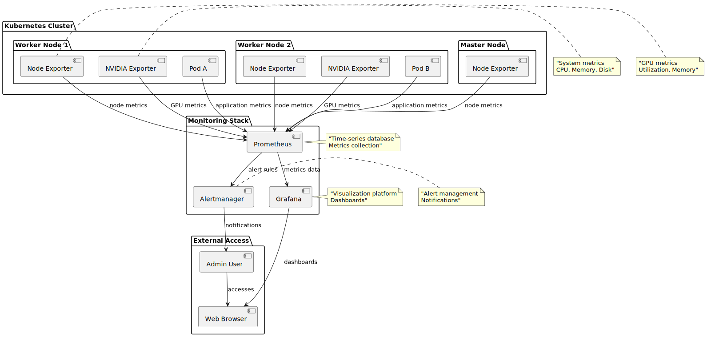
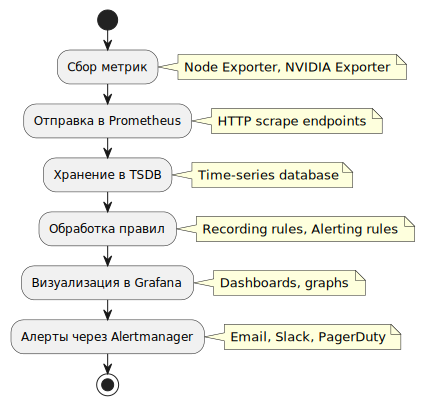
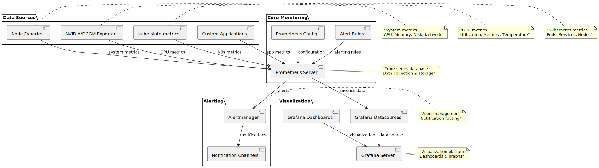

# 📊 Monitoring System - Сводка

## 🎯 Что создано

### 1. Роль Ansible (`monitoring/`)
- **`defaults/main.yml`** - настройки системы мониторинга
- **`tasks/main.yml`** - задачи для автоматической установки
- **`README.md`** - подробная документация

### 2. Компоненты системы:
- **Prometheus** - сбор и хранение метрик
- **Grafana** - визуализация и дашборды
- **Node Exporter** - метрики узлов кластера
- **Alertmanager** - готов к настройке алертов

### 3. Примеры и тестирование:
- **`examples/monitoring-alerts.yml`** - примеры алертов
- **`scripts/test-monitoring.sh`** - автоматический тест
- **`QUICK_START_MONITORING.md`** - быстрый старт

## 🚀 Как использовать

### Установка
```bash
ansible-playbook -i inventory.yml site.yml --tags monitoring
```

### Тестирование
```bash
./scripts/test-monitoring.sh
```

### Доступ к интерфейсам
```bash
# Prometheus
kubectl port-forward -n monitoring svc/prometheus 9090:9090
# http://localhost:9090

# Grafana
kubectl port-forward -n monitoring svc/grafana 3000:3000
# http://localhost:3000 (admin/admin123)
```

## ✅ Что мониторится

### Узлы кластера:
- CPU использование
- Память (RAM)
- Дисковое пространство
- Сетевая активность

### Kubernetes:
- Состояние подов и сервисов
- Использование ресурсов
- События кластера

## Схемы стека мониторинга

Ниже — три взаимодополняющие схемы: **архитектура** (кто с кем связан), **поток данных** (от экспортеров до алертов) и **состав компонентов** (источники метрик, ядро, визуализация, уведомления). Их удобно читать вместе с разделом «Что мониторится» выше.



[Исходник PlantUML](../../diagram-assets/src/diagram-09-monitoring-architecture.puml)



[Исходник PlantUML](../../diagram-assets/src/diagram-10-monitoring-data-flow.puml)



[Исходник PlantUML](../../diagram-assets/src/diagram-11-monitoring-components.puml)

### Приложения:
- Доступность сервисов
- Время ответа
- Количество запросов

## 📊 Настройка Grafana

### 1. Добавление Prometheus как источника данных:
- URL: `http://prometheus.monitoring.svc.cluster.local:9090`

### 2. Рекомендуемые дашборды:
- **Kubernetes Cluster Monitoring** (ID: 315)
- **Node Exporter Dashboard** (ID: 1860)
- **Prometheus Stats** (ID: 3662)

## 🚨 Алерты

### Готовые алерты:
- Высокое использование CPU (>80%)
- Высокое использование памяти (>85%)
- Низкое дисковое пространство (<10%)
- Узлы недоступны
- Поды в состоянии crash loop
- Сервисы недоступны

### Применение алертов:
```bash
kubectl apply -f examples/monitoring-alerts.yml
```

## 🔧 Конфигурация

### Основные настройки:
```yaml
prometheus_enabled: true
grafana_enabled: true
node_exporter_enabled: true
monitoring_storage_class: "local-storage"
```

### Ресурсы:
- **Prometheus**: 512Mi-1Gi RAM, 250m-500m CPU
- **Grafana**: 128Mi-256Mi RAM, 100m-200m CPU
- **Node Exporter**: 64Mi-128Mi RAM, 50m-100m CPU

## 📁 Структура файлов

```
monitoring/
├── defaults/main.yml          # Настройки
├── tasks/main.yml             # Задачи Ansible
└── README.md                  # Документация

examples/
└── monitoring-alerts.yml      # Примеры алертов

scripts/
└── test-monitoring.sh         # Тестовый скрипт

QUICK_START_MONITORING.md      # Быстрый старт
MONITORING_SUMMARY.md          # Эта сводка
```

## 🛠 Устранение неполадок

### Полезные команды:
```bash
# Проверка подов
kubectl get pods -n monitoring

# Логи Prometheus
kubectl logs -n monitoring deployment/prometheus

# Логи Grafana
kubectl logs -n monitoring deployment/grafana

# Проверка метрик
kubectl exec -n monitoring deployment/prometheus -- wget -qO- http://localhost:9090/api/v1/query?query=up
```

## 📈 Полезные запросы Prometheus

### CPU использование:
```
100 - (avg by(instance) (irate(node_cpu_seconds_total{mode="idle"}[5m])) * 100)
```

### Память использование:
```
(node_memory_MemTotal_bytes - node_memory_MemAvailable_bytes) / node_memory_MemTotal_bytes * 100
```

### Количество подов:
```
count(kube_pod_info)
```

## 🎯 Рекомендации для кластера из 10 машин

1. **Настройте retention** - 15 дней для Prometheus
2. **Мониторьте дисковое пространство** - метрики растут быстро
3. **Настройте алерты** - для критических событий
4. **Регулярно обновляйте** - версии компонентов
5. **Настройте бэкапы** - конфигурации Grafana

## 🔄 Следующие шаги

1. ✅ **Monitoring установлен**
2. 🔄 **Настройте дашборды в Grafana**
3. 🔄 **Настройте алерты**
4. 🔄 **Настройте внешний доступ**
5. 🔄 **Настройте бэкапы метрик**
6. 🔄 **Добавьте пользовательские метрики**

## 📚 Дополнительные ресурсы

- [Prometheus Documentation](https://prometheus.io/docs/)
- [Grafana Documentation](https://grafana.com/docs/)
- [Kubernetes Monitoring Best Practices](https://kubernetes.io/docs/tasks/debug-application-cluster/resource-usage-monitoring/)
