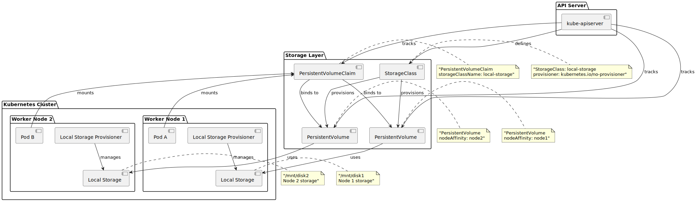
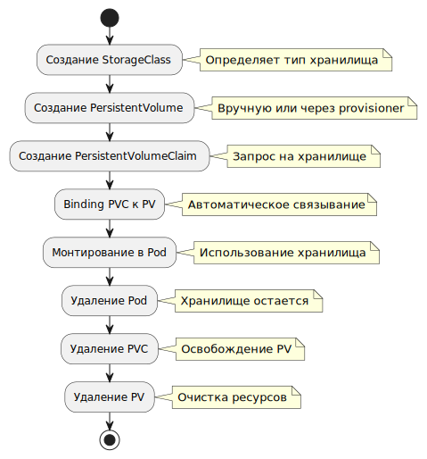

# 📋 Local Storage Provisioner - Сводка

## 🎯 Что создано

### 1. Роль Ansible (`storage/`)
- **`defaults/main.yml`** - настройки по умолчанию
- **`tasks/main.yml`** - задачи для установки
- **`README.md`** - подробная документация

### 2. Примеры использования (`examples/`)
- **`local-storage-example.yml`** - демо-приложение с Local Storage

### 3. Тестирование (`scripts/`)
- **`test-local-storage.sh`** - автоматический тест функциональности

### 4. Документация
- **`QUICK_START_LOCAL_STORAGE.md`** - быстрый старт
- **`LOCAL_STORAGE_SUMMARY.md`** - эта сводка

## 🚀 Как использовать

### Установка
```bash
ansible-playbook -i inventory.yml site.yml --tags storage
```

### Тестирование
```bash
./scripts/test-local-storage.sh
```

### Демо-приложение
```bash
kubectl apply -f examples/local-storage-example.yml
kubectl port-forward svc/storage-demo 8080:80
```

## ✅ Преимущества Local Storage

- **Простота** - минимальная настройка
- **Производительность** - данные хранятся локально
- **Ресурсы** - низкое потребление ресурсов
- **Скорость** - быстрое развертывание

## ⚠️ Ограничения

- **Нет репликации** - данные только на одном узле
- **Привязка к узлу** - поды должны быть на том же узле
- **Потеря данных** - при выходе узла из строя

## Схемы: архитектура и жизненный цикл тома

Ниже две схемы для связи текста выше с объектами Kubernetes: как **Local Storage Provisioner**, **StorageClass**, **PV/PVC** и поды согласуются на узлах, и как проходит **жизненный цикл PersistentVolume** от выделения до освобождения.



[Исходник PlantUML](../../diagram-assets/src/diagram-07-storage-architecture.puml)



[Исходник PlantUML](../../diagram-assets/src/diagram-08-persistentvolume-lifecycle.puml)

## 🎯 Рекомендации для кластера из 10 машин

1. **Начните с Local Storage** - идеально для начала
2. **Мониторьте диски** - настройте алерты
3. **Планируйте бэкапы** - регулярно сохраняйте данные
4. **При росте** - рассмотрите Longhorn

## 📁 Структура файлов

```
storage/
├── defaults/main.yml          # Настройки
├── tasks/main.yml             # Задачи Ansible
└── README.md                  # Документация

examples/
└── local-storage-example.yml  # Демо-приложение

scripts/
└── test-local-storage.sh      # Тестовый скрипт

QUICK_START_LOCAL_STORAGE.md   # Быстрый старт
LOCAL_STORAGE_SUMMARY.md       # Эта сводка
```

