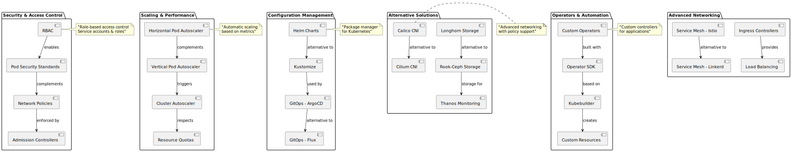

# Справочные материалы

В этом разделе собраны дополнительные материалы, которые помогают углубить понимание темы:

- ссылки на внешние ресурсы и документацию;
- схемы и диаграммы по архитектуре;
- заметки по версионированию документации в проекте.

Перед углублённым изучением конкретных компонентов рекомендуется сначала пройти основное учебное пособие.

## Карта смежных тем (расширенный контур)

После базового курса полезно видеть «ландшафт» смежных направлений: безопасность, масштабирование, пакеты и GitOps, сеть и хранилище, операторы и наблюдаемость. Схема ниже не заменяет отдельные главы, но помогает выбрать следующий фокус обучения.

[Исходник PlantUML](../diagram-assets/src/diagram-15-advanced-topics-map.puml)

